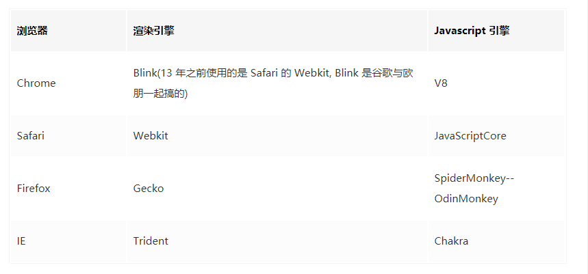
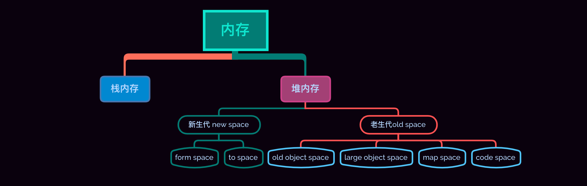
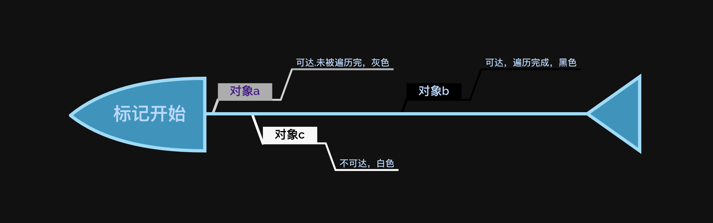

# V8 引擎垃圾回收与内存分配

提到浏览器内核，Blink、Weikit、Gecko、Trident 张口就来，这些只是各个浏览器内核的组成部分之一渲染引擎，对应的还有 JavaScript 引擎，简单罗列一下：

JS 是没有能力管理内存和垃圾回收的，一切都要依赖各个浏览器的 JS 引擎，所以为了逼格更高一点，就不要说 JS 垃圾回收了，你看，我说 V8 垃圾回收，是不是厉害多了

## 内存分配

栈
简单说，栈内存，小且存储连续，操作起来简单方便，一般由系统自动分配，自动回收，所以文章内所说的垃圾回收，都是基于堆内存。

堆
堆内存，大(相对栈来说)且不连续。

## V8 中内存分类

在讲内存分配之前，先了解一下弱分代假说，V8 的垃圾回收主要建立在这个假说之上。
概念：

绝大部分的对象生命周期都很短，即存活时间很短
生命周期很长的对象，基本都是常驻对象

基于以上两个概念，将内存分为**新生代 (new space)与老生代 (old space)**两个区域。划重点，记一下。

## 垃圾回收机制

### 新生代

新生代(32 位系统分配 16M 的内存空间，64 位系统翻倍 32M，不同浏览器可能不同，但是应该差不了多少)。
新生代对应存活时间很短的假说概念，这个空间的操作，非常频繁，绝大多数对象在这里经历一次生死轮回，基本消亡，没消亡的会晋升至老生代内。
新生代算法为 Scavenge 算法，典型牺牲空间换时间的败家玩意，怎么说呢？首先他将新生代分为两个相等的半空间( semispace ) from space 与 to space，来看看这个败家玩意，是怎么操作的，他使用宽度优先算法，是宽度优先，记住了不。两个空间，同一时间内，只会有一个空间在工作( from space )，另一个在休息( to space )。

1、首先，V8 引擎中的垃圾回收器检测到 from space 空间快达到上限了，此时要进行一次垃圾回收了

2、然后，从根部开始遍历，不可达对象(即无法遍历到的对象)将会被标记，并且复制未被标记的对象，放到 to space 中

3、最后，清除 from space 中的数据，同时将 from space 置为空闲状态，即变成 to space，相应的 to space 变成 from space，俗称翻转

对于小对象，这么来一次，时间的优势那是杠杠的，虽然浪费了一半空间，但是问题不大，能 hold 住。
当然优秀的 V8 是不可能容忍，一个对象来回的在 form space 和 to space 中蹦跶的，当经历一次 form => to 翻转之后，发现某些未被标记的对象居然还在，会直接扔到老生代里面去，好似后浪参加比赛，晋级了，优秀的嘞。
除了上面一种情况，还有一个情况也会晋级，当一个对象，在被复制的时候，大于 to space 空间的 25% 的时候，也会晋级了，这种自带背景的选手，那是不敢动的，直接晋级到老生代。

### 老生代( 32 位操作系统分配大约 700M 内存空间，64 位翻倍 1.4G，一样，每个浏览器可能会有差异，但是差不了多少)。

老生代比起新生代可是要复杂的多，所谓能者多劳，空间大了，责任就大了，老生代可以分为以下几个区域：

**old object space **即大家口中的老生代，不是全部老生代，这里的对象大部分是由新生代晋升而来

**large object space **大对象存储区域，其他区域无法存储下的对象会被放在这里，基本是超过 1M 的对象，这种对象不会在新生代对象中分配，直接存放到这里，当然了，这么大的数据，复制成本很高，基本就是在这里等待命运的降临不可能接受仅仅是知其然，而不知其所以然

**Map space **这个玩意，就是存储对象的映射关系的，其实就是隐藏类，啥是隐藏类？就不告诉你(不知道的大佬已经去百度了)

**code space **简单点说，就是存放代码的地方，编译之后的代码，是根据大佬们写的代码编译出来的代码

讲了这么多基本概念，聊聊最后的老生代回收算法，老生代回收算法为：标记和清除/整理（mark-sweep/mark-compact）。

在标记的过程中，引入了概念：三色标记法，三色为：

白：未被标记的对象，即不可达对象（没有扫描到的对象），可回收

灰：已被标记的对象（可达对象），但是对象还没有被扫描完，不可回收

黑：已被扫描完（可达对象），不可回收

当然，既然要标记，就需要提供记录的坑位，在 V8 中分配的每一个内存页中创建了一个 marking bitmap 坑位。

大致的流程为：

1、首先将所有的非根部对象全部标记为白色，然后使用深度优先遍历，是深度优先哈，和新生代不一样哈，按深度优先搜索沿途遍历，将访问到的对象，直接压入栈中，同时将标记结果放在 marking bitmap (灰色) 中，一个对象遍历完成，直接出栈，同时在 marking bitmap 中记录为黑色，直到栈空为止，来张图，休息一下

2、标记完成后，接下来就是等待垃圾回收器来清除了，清除完了之后，会在原来的内存区域留下一大堆不连续的空间，小对象还好说，这个时候如果来一个稍微大一点的对象，没有内存可以放的下这个傻大个了，怎么办？只能触发 GC，但是吧，原来清除的不连续的空间加起来又可以放的下这个傻大个，很可惜啊，启动一次 GC 性能上也是嗖嗖的往下掉啊；V8 能容许这样的事发生？肯定不存在嘛！

3、所以在清除完之后，新生代中对象，再一次分配到老生带并且内存不足的时候，会优先触发标记整理（mark-compact）, 在标记结束后，他会将可达对象(黑色)，移到内存的另一端，其他的内存空间就不会被占用，直接释放，等下次再有对象晋升的时候，轻松放下。

看到这里各位大佬可能会有疑问，那要是我 GC 搞完之后，再来个对象，满了咋办，你说咋办，直接崩好不好，这个时候就需要大佬们写代码的时候，要珍惜内存了，对内存就像珍惜你的女朋友一样，啥？没有女朋友？ 那就没办法了，原则上是决不了这个问题的。

### 写屏障

想一个问题，当 GC 想回收新生代中的内容的时候，某些对象，只有一个指针指向了他，好巧不巧的是，这个指针还是老生代那边对象指过来的，怎么搞？我想回收这个玩意，难道要遍历一下老生代中的对象吗？这不是开玩笑吗？为了回收这一个玩意，我需要遍历整个老生代，代价着实太大，搞不起，搞不起，那怎么办哩？

V8 引擎中有个概念称作写屏障，在写入对象的地方有个缓存列表，这个列表内记录了所有老生代指向新生代的情况，当然了新生成的对象，并不会被记录，只有老生代指向新生代的对象，才会被写入这个缓存列表。

在新生代中触发 GC 遇到这样的对象的时候，会首先读一下缓存列表，这相比遍历老生代所有的对象，代价实在是太小了，这操作值得一波 666，很优秀，当然了，关于 V8 引擎内在的优化，还有很多很多。

### 全停顿（stop-the-world）

关于全停顿，本没有必要单独来讲

在以往，新/老生带都包括在内，为了保证逻辑和垃圾回收的情况不一致，需要停止 JS 的运行，专门来遍历去遍历/复制，标记/清除，这个停顿就是：全停顿。
这就比较恶心了，新生代也就算了，本身内存不大，时间上也不明显，但是在老生代中，如果遍历的对象太多，太大，用户在此时，是有可能明显感到页面卡顿的，体验嘎嘎差。
所以在 V8 引擎在名为 Orinoco 项目中，做了三个事情，当然只针对老生代，新生代这个后浪还是可以的，效率贼拉的高，优化空间不大。三个事情分别是：

增量标记

将原来一口气去标记的事情，做成分步去做，每次内存占用达到一定的量或者多次进入写屏障的时候，就暂时停止 JS 程序，做一次最多几十毫秒的标记 marking，当下次 GC 的时候，反正前面都标记好了，开始清除就行了

并行回收

从字面意思看并行，就是在一次全量垃圾回收的过程中，就是 V8 引擎通过开启若干辅助线程，一起来清除垃圾，可以极大的减少垃圾回收的时间，很优秀，手动点赞

并发回收

并发就是在 JS 主线程运行的时候，同时开启辅助线程，清理和主线程没有任何逻辑关系的垃圾，当然，需要写屏障来保障

## 小结

V8 引擎做的优化有很多，还有比如多次( 2 次)在新生代中能够存活下来的对象，会被记录下来，在下次 GC 的时候，会被直接晋升到老生代，还有比如新晋升的对象，直接标记为黑色，这是因为新晋升的对象存活下来的概率非常高，这两种情况就算是不再使用，再下下次的时候也会被清除掉，影响不大，但是这个过程，第一种就省了新生代中的一次复制轮回，第二种就省了 marking 的过程，在此类对象比较多的情况下，还是比较有优势的。
