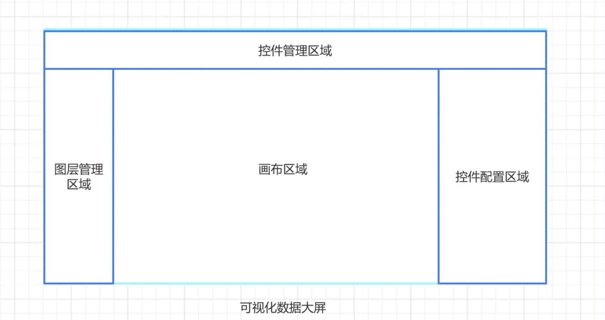

# 大屏数据可视化

## 目标

1、帮助前端开发人员更好，更快的开发大屏页面。

2、帮助产品、销售更直观介绍我们的产品。

## 思路

- 可视化大屏产品设计思路
- 主流可视化图表库技术选型
- 大屏编辑器设计思路
- 大屏可视化编辑器 Schema 设计
- 用户数据自治探索

## 难点与解决思路

### 1、布局

数据大屏的核心就是数据的拼接，具体到展示层可以归纳成数据块的拼接。可以采用通用的尺寸 1920\*1080(16:9)。尺寸确立后，接下来要对展示层进行布局和页面的划分。这里的划分，主要根据我们定好的业务指标进行，核心业务指标安排在中间位置、占较大面积；其余的指标按优先级依次在核心指标周围展开。一般把有关联的指标让其相邻或靠近，把图表类型相近的指标放一起，这样能减少观者认知上的负担并提高信息传递的效率。
但是如何适应不同分辨率的屏幕，成为一道难题，解决方案分别是

1、基于 transform 缩放的方案，优点是按设计稿设置元素大小，无需转换长度单位。缺点是放大展示时，echarts 等图表会出现失真现象。为了避免图表失真，设计稿设计应按大屏尺寸设计，使其在屏幕中缩小展示。比如 1920*1080 和 1366*768 同为 16:9 的设计稿，应按 1920\*1080 尺寸设计。

2、基于 rem 的缩放方案，元素长度单位需转换为 rem。放大展示时，不会出现图表失真的情况。当缩小至根元素 fontsize<12px 时，由于浏览器展示的最小字号是 12px，文字不能被再缩小，会出现比例不协调的情况。解决办法是，设置画布的最小宽度和最小高度，当屏幕小于最小宽度和最小高度时增加滚动条，使画布不再被缩小。

3、vh、vw、rem 组合方式，以上两种方法都存在占不满屏幕的问题，要占满屏幕必须得 非等比缩放，即宽高都按照自己的比例进行缩放，但是这样图片会失真。因此定义父级大小，之后进行组件的 height、margin、padding 等多种 css 属性采用 rem 作为单位，继承父级设置等单位（1vw）,实现适配。缺点 仅能满足一些特定的小场景，大屏中的实施非常不友好，例如我们覆盖 element 表格中的为 font-size：0.5rem。此时投放到大屏，字体是自适应的，但其组件的多种默认属性用 px 为单位。如 line-height 的设置为 22px，此时覆盖样式后的字体过大，并不能适应行高，就会出现文字重叠等错乱问题。

4、css3 的缩放 transform: scale(X)属性。封装全局组件，只要监听浏览器窗口大的小，同时控制变化的比例就可以了。

同时应当注意根据美工给出的设计（主要获取美工给出的分辨率，如 1920\*1080）。
Div 布局多采用 flex+百分比布局（当然也可以根据美工给出的设计，默认写 px。）。
各类空间设计，根据美工给出的 px 进行定义即可

### 2、主流可视化图表库技术选型

目前调研的已知主流可视化库有:

- echart 一个基于 JavaScript 的老牌开源可视化图表库
- D3.js 一个数据驱动的可视化库, 可以不需要其他任何框架独立运行在现代浏览器中，它结合强大的可视化组件来驱动 DOM 操作
- antv 包含一套完整的可视化组件体系
- Chart.js 基于 HTML5 的 简单易用的 JavaScript 图表库
- metrics-graphics 建立在 D3 之上的可视化库, 针对可视化和布置时间序列数据进行了优化
- C3.js 通过包装构造整个图表所需的代码，使生成基于 D3 的图表变得容易

### 3、大屏编辑器设计思路

主要包含以下部分:

- 组件库
- 拖拽(自由拖拽, 参考线, 自动提示)
- 画布渲染器
- 属性编辑器


伪代码可设计成类似

```js
import { Chart } from "@antv/f2";
import React, { memo, useEffect, useRef } from "react";

import styles from "./index.less";
import { IChartConfig } from "./schema";

const XChart = (props: IChartConfig) => {
  const { data, color, size, paddingTop, title } = props;
  const chartRef = useRef(null);
  useEffect(() => {
    const chart = new Chart({
      el: chartRef.current || undefined,
      pixelRatio: window.devicePixelRatio, // 指定分辨率
    });

    // step 2: 处理数据
    const dataX = data.map((item) => ({ ...item, value: Number(item.value) }));

    // Step 2: 载入数据源
    chart.source(dataX);

    // Step 3：创建图形语法，绘制柱状图，由 genre 和 sold 两个属性决定图形位置，genre 映射至 x 轴，sold 映射至 y 轴
    chart.interval().position("name*value").color("name");

    // Step 4: 渲染图表
    chart.render();
  }, [data]);
  return (
    <div className={styles.chartWrap}>
      <div
        className={styles.chartTitle}
        style={{ color, fontSize: size, paddingTop }}
      >
        {title}
      </div>
      <canvas ref={chartRef}></canvas>
    </div>
  );
};

export default memo(XChart);
```

- 拖拽功能的调研 成熟的组件库有

  - rc-drag
  - sortablejs
  - react-dnd
  - react-dragable
  - vue-dragable

- 拖拽流程大概分为

  - 1、使用 H5 dragable API 拖拽左侧组件(component data)进入目标容器(targetBox)
  - 2、监听拖拽结束事件拿到拖拽事件传递的 data 来渲染真实的可视化组件
  - 3、可视化组件挂载, schema 注入编辑面板, 编辑面板渲染组件属性编辑器
  - 4、拖拽, 属性修改, 更新
  - 5、预览, 发布
