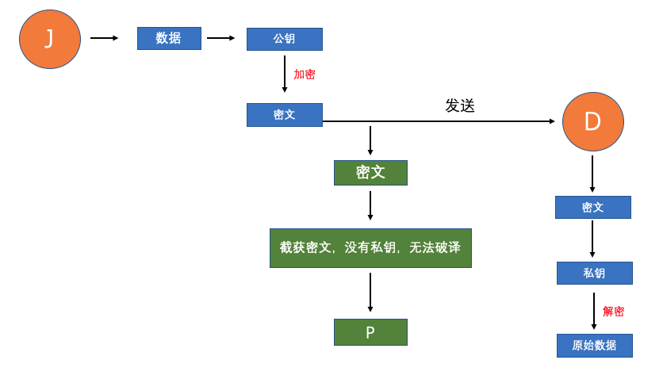

## 实时通信

Web 应用的信息交互过程通常是客户端通过浏览器发送请求，服务器端接收请求后，进行验证处理将结果返给客户端，最后客户端浏览器将信息呈现出来。

这种机制对于低频率的信息变化是完全可以胜任的，如果对一些数据刷新频率要求比较高的应用来说，当客户端浏览器正要展示这些信息的时候，它可能已经在服务器端过期了。

所以对于一个应用或者页面来说，保持客户端和服务器端的信息同步是实时 Web 应用的关键技术，本文主要介绍 HTTP 的实时 Web 通信方案。

### web 通信

传统的通信方式
我们电脑上的浏览器并不具有通过系统调用来达到和另外一个客户端浏览器通信的功能。这和我们桌面应用的工作方式是不同的，通常桌面应用通过 socket 可以和远程主机上另外一端的一个进程建立 TCP 连接，从而达到即时通信。

浏览器从开始一直是客户端请求服务器，服务器返回结果的模式，发展至今仍然没有任何改变。所以可以肯定的是，要想实现两个客户端的通信，必然要通过服务器的信息转发。例如 J 要和 D 通信，就应该是 J 先把信息发给应用服务器，服务器根据 J 的信息将它再转发给 D，同样 D 到 J 也是这种模式。

三握四挥

SYN(synchronous)：表示建立连接 ACK(acknowledgement) ：表示响应 PSH(push)：表示有 DATA 数据传输 FIN(finish)：表示关闭连接 RST(reset)：表示连接重置 URG(urgent)：紧急标志位，表示的是此报文段中有紧急数据 Sequence number：序列号 Acknowledge number：确认号码 SYN_SENT：表示请求连接 ESTABLISHED：建立连接 SYN_RCVD：表示接受到了 SYN 报文 ESTABLISHED：代表一个打开的连接 FIN WAIT 1:（主动关闭）已经发送关闭请求，等待确认 FIN WAIT 2:（主动关闭）收到对方关闭确认，等待对方关闭请求 LAST ACK:（被动关闭）等待最后一个关闭确认，并等待所有分组死掉 CLOSE WAIT:（被动关闭）收到对方关闭请求，已经确认 MSL：报文最大生存时间（RFC 793 中规定 MSL 为 2 分钟，实际应用中常用的是 30 秒，1 分钟和 2 分钟等）

### HTTP/HTTPS

#### HTTP

HTTP，超文本传输协议，它是基于 TCP 实现的应用层协议，它开始工作的前提是 TCP 连接已经建立，HTTP 协议与 IP 协议共同组成 Internet，这就是我们常说的 TCP/IP 协议，我们也可以把 Internet 称作是 TCP/IP 网络。因为 HTTP 是比 TCP 更高层次的应用层协议，根据规则，只有低层协议建立之后才能，才能进行更层协议的连接。

HTTP 传输的数据类型为 HTML 文件、图片文件、 其他结果等，它由请求和响应构成，是一个标准的客户端服务器模型（B/S），因为它不需要建立一个持久的连接，所以它一直都是由客户端发起请求，服务器进行响应。

HTTP 的请求过程中，客户端和服务器之间没有确认身份的过程，数据全部明文传输，直接暴露在互联网上的，所以这就很容易遭到黑客的攻击。黑客会劫持客户端发给服务器的信息，然后冒充服务器发给用户任意信息；所以就造成了诸如消息监听、消息篡改、冒充身份等一些安全问题。

#### HTTP/2

HTTP/2 的主要目标是通过支持完整的请求与响应复用来减少延迟，通过有效压缩 HTTP 标头字段将协议开销降至最低，同时增加对请求优先级和服务器推送的支持。 同时他还带来了其他协议层面的辅助实现，例如新的流控制、错误处理和升级机制。
HTTP/2 性能增强的核心有很多，我们简单说一下 HTTP/2 新增的一个强大的新功能服务器推送。服务器可以对一个客户端请求发送多个响应。

它不在遵守最初的请求-响应模式，支持一对多和服务器发起的推送工作流，除了对最开始请求的响应外，服务器还可以向客户端推送其他资源，不需要客户端再去请求。可以理解为还没有收到浏览器的请求，服务器就把各种资源推送给浏览器。

比如，浏览器只请求了 app.html，服务器会把 app.html、app.css、app.js 全部发送给浏览器。如此一来，只需要一次请求就可以把所有的资源都加载完毕，间接提高了性能。

这种机制存在的原因很简单，比如我们现在的一个网络应用会包含很多的资源，客户端需要逐个检查来找到他们，所以这是害怕如果让服务器提前推送的话，是不是就减少了额外的请求时间，那问题又来了，服务器怎么知道客户端需要什么文件哪？其实，我们在网页中使用内联的 css 、js 等资源的话，其实这就属于推送，内联的过程实际上就是把资源直接发给客户端，不是让客户端去请求。推送的资源一般可以由客户端缓存，可以在其他页面复用，并且制定文件的优先级等

#### HTTPS

HTPPS 并不是新的协议，只是引入了安全层 SSL/TSL，进化为 HTTP 首先和 SSL/TSL 进行通信，再由 SSL/TSL 和 TCP 通信，所以 HTTPS 就是身穿 SSL/TSL 协议的 HTTP。

SSL 提供加密处理，并且使用数字证书的手段，用于确定通信方。证书由第三方机构颁发，通过第三机构的私钥进行加密，难以伪造。我们通过证书就可以确认服务器和客户端的是否真实存在。

TLS 主要保证两个通信应用程序之间提供保密性和数据完整性，在浏览器、邮箱、即时通信、网络传真等应用程序中，广泛支持这个协议。如 Google、Facebook 等也以此协议建立连接。
下面我们一起了解一下 SSL/TLS 是通过哪些算法实现的？

##### 1、对称加密

如果 J 通过互联网向 D 发送数据，如果不对数据进行加密，数据就可能被恶意的第三者 P 看到, 所以保密的数据需要进行加密再发送。这个方法的缺点也很明显，就是需要使用相同的密钥进行加密和解密，因为这个钥匙也要通过网络传输，所以也很可能会被 P 拦截。


##### 2、非对称加密

因为对称加密用单个密匙加解密存在很大的风险，如果将密匙分为 2 个，保存在服务端的是私有密匙，发送给客户端的是公有密匙。私有密匙保存在服务端是相对安全的，公有密匙是所有客户端或者劫持者都可以得到。现在通信就是使用公钥加密，私钥解密，这个时候因为劫持者没有私钥，就无法修改客户端传输的数据，也无法解密数据。但是这样是保证了安全，代价就是加密解密的时间过长。


##### 3、混合加密

因为对称加密效率高，非对称加密安全性强，这种方式采用的就是二合一的加密方式。道理很简单就是通过公开密钥加密客户端的密钥传给服务端，再通过对称密钥方法传递数据。HTTPS 目前就是采用的这种方式加密。


其实这样的加密手段依旧不是安全的，传输过程中我们是无法保证服务器返回的公钥不被截获。如果黑客把服务器返回的公钥转换成自己的公钥，然后他就可以对客户端的的所有消息使用自己的私钥解密。这个问题的根本所在就是我们无法分辨出返回的数据是否是真正的来自服务器。针对这个问题的解决方法就是：使用数字证书来证明信息发送方的身份。

##### 4、数字证书

数字证书，顾名思义，它是一个用于验证身份的数字认证，由公认的证书机构颁发给服务器的。它的基本架构是利用一对秘钥实施加密和解密。其中密钥包括私钥和公钥，私钥主要用于签名和解密，由用户自定义，只有用户自己知道；公钥用于签名验证和加密，可被多个用户共享。

##### 5、https 的详细工作流程


希望关于 HTTPS 的这些介绍能帮助大家更好的理解和回顾，有理解偏差的地方，希望大家多多指正。那么我们可以思考一个问题就是：既然 HTTPS 这么安全，为什么我们利用抓包工具还能捕捉到数据哪？这里其实我们扮演了一个中间人的身份，也就是中间人攻击，HTTPS 的主要作用是防止在不知情的情况下通信被监听，如果我们主动信任某个证书，就会构成 “中间人攻击” ，代理软件就是这个道理，这样就可以对传输内容进行解密。其中的详细实现过程，大家可以自己更深入的了解一下。

### 实时 web 通信

web 的信息交互过程在上面已经讲的比较清楚了。HTTP 协议的工作模式就是客户端向服务器发送请求，服务器接受请求后返回响应数据，这种交互机制对于信息的请求是没有问题的，尤其适用现在的 B/S 架构。但现在 web 应用越来越发达，用户对信息的更新频率期望达到实时同步的状态，再使用这种工作模式去应对 C/S 架构的一些应用就略显吃力，这个时候我们就需要新的技术才应对，那就是：web 实时通信技术。

#### 短轮询

这种轮询的基本思路就是浏览器每隔一段时间发送 http 请求，服务器端在收到请求后，不会考虑数据是否是最新的就直接返回。这种方式实现的即时通信，实际上还是浏览器发送请求，服务器接受请求的一个过程，通过客户的频繁请求，使客户端能模拟实时接收到服务端的数据变化。

```js
function request() {
  setTimeout(function () {
    $.get("/XXXX/YYYY", function (data, status) {
      console.log(data);
      // 下次请求
      request();
    });
  }, 20000);
}
```

这种方式的对于客户端和服务端的实现都比较简单，但如果请求过于频繁，无用的请求也会增加，这样会浪费很多的网络和服务器资源；反之请求间隔太长的话，数据的时效性就会大打折扣，所以这种方式适合小型应用场景。

#### COMET

针对短轮询的一些弊端，我们自然会想到减少不必要的请求，提高实时通信的效率，所以基于 HTTP 长连接的“服务器推”技术 — comet 出现了。常用的 COMET 主要有基于 HTTP 的长轮询（long-polling）技术，以及基于 iframe 的长连接流（stream）模式。

#### 长轮询

长论询的逻辑就是客户端向服务器发送一个请求，服务器接受后不会马上做出回应，而是把这个请求挂起，只有在数据更新时才会将这个数据返给客户端。

短轮询与长轮询都是基于 HTTP 的，他们都渴望获得更及时的相应内容，长轮询对处理并发的能力要求较高；这两种方式下服务器都不会主动推送消息，只有在客户端发送请求后返回内容。虽然有效的减少了 HTTP 请求，但相对来说请求次数还是很多的，因为每次数据的更新都需要建立一个新的 HTTP 请求，同时服务端将这个连接挂起后，长期占用，也是一种资源的浪费。

#### 基于 iframe 的长连接流（stream）模式

iframe 流方式是在页面中插入一个隐藏的 iframe，利用其 src 属性在服务器和客户端之间创建一条长连接，服务器向 iframe 传输数据（通常是 HTML，内有负责插入信息的 javascript），来实时更新页面。

基本思路就是使用 iframe 方案，在页面中加入一个隐藏的 iframe 标签，将其 src 属性设置为要保持长连接的 url，服务器会向 iframe 传输 html 数据，返回的数据中会有处理信息的 js 代码来完成。比如数据中有这么一行代码（下方），我们需要提前在父页面定义好这个方法。

```js
<script type="text/javascript">callback(“do something ”);</script>
```


iframe 流的方式对于消息的实时性效果较好，同时浏览器的兼容性；客户端只需要请求一次，但服务端却是源源不断向客户端发送数据，这样服务器维护一个长连接就会增加开销，同时这种方式在 IE、Chrome、Firefox 显示加载未完成，标签页上的图标一直旋转，体验上会有一些差异。

#### SSE

SSE（Server-Sent Events） 是 HTML5 的新增功能。它与前面的方式最大的不同就是不需要客户端发送请求，服务器数据更新了就能马上发送客户端，可以理解为这种模式是服务器到客户端的单向连接模式，只允许服务器向客户端发送消息。前提是它也需要客户端和服务端建立连接，从而维持这个连接。

SSE 的使用方法比较简单，它的 API 是 EventSource 对象。

```js
const sse = new EventSource("url");
// 建立连接时触发
sse.addEventListener("open", function (e) {}, false);
// 接收到新消息时触发
sse.addEventListener("message", function (e) {}, false);
// 无法建立连接时触发
sse.addEventListener("error", function (e) {}, false);
```

HTTP 响应内容有一种特殊的 content-type — text/event-stream，该响应头标识了响应内容为事件流，客户端不会关闭连接，而是等待服务端不断的发送响应结果。

通常情况下，EventSource 对象始终保持与服务器的连接。如果断开会自动重连；要是想永久断开，调用 sse.close() 方法即可。同时 SSE 支持自定义事件，比如这样实现。（下方）

```js
sse.addEventListener(
  "自定义事件名",
  function (e) {
    //do something
  },
  false
);
```

SSE 不需要建立或保持大量的客户端发往服务器端的请求，节省了很多网络资源，提升应用性能。

#### WebSocket

WebSocket 大家肯定不陌生，WebSocket 的出现使浏览器拥有了双向实时通信的能力，WebSocket 并不是新的协议，它是基于 TCP 传输协议，并复用 HTTP 的握手通道。

建立连接
WebSocket 的连接是由浏览器发起的，基本的请求格式如下：

这个请求和普通的请求有些许不同：

1、请求的地址不是 /path/，而以 ws:// 开头的地址，webSocket 引入了两种新的 url 方案：ws 是未加密的，默认端口为 80 ，而 wss 需要使用 TLS 加密，默认端口为 443 ；

2、请求头 Upgrade: websocket 和 Connection: Upgrade 表示这个连接将要被升级为 WebSocket 连接；

3、Sec-WebSocket-Key 是用于标识这个连接，提供一个保护作用，并不是数据加密，它和服务端的返回的 Sec-WebSocket-Accept 对应；

4、Sec-WebSocket-Version 表示 WebSocket 的协议版本。

上图可知这个请求已经建立连接，相应代码 101 表示协议切换成了 websocket。websocket 有些类似长连接的模式，连接建立后，后面的数据更新都以帧序列的形式传输。在客户端断开 webSocket 连接或服务端断开前，不需要重新建立连接。在高并发及交互频繁的情况下，这很大程度上节省网络资源，因为始终保持在同一个持久连接上，实时性优势明显。

数据帧传输

数据可以被分割成多个帧。传输数据的第一帧有一个操作码，表示正在传输的数据是什么类型的。

当 WebSocket 的接收方收到一个数据帧时，会根据 FIN 的值来判断，是否已经收到消息的最后一个数据帧。FIN=1 表示当前数据帧是最后一个数据帧，接收方已经收到完整的消息。FIN=0 表示接收方需要继续监听接收其余的数据帧。

opcode 在通信的过程中，表示的是数据的类型。0x01 表示文本，0x02 表示二进制。而 0x00 比较特殊，表示延续帧（continuation frame），就是完整消息对应的数据帧还没接收完。

分片的主要目的是在消息启动时允许发送未知大小的消息。有了分片，服务器可能会选择一个合理大小的缓冲区，当缓冲区满时，将一个帧写入网络。分片的二次使用情况是多路复用，在一个逻辑信道上的大消息接管整个输出信道是不可取的，所以多路复用需要自由将消息分成较小的片段以更好地共享输出渠道。

通过 WebSocket 发送数据的 API 比较简单：

```js
const ws = new WebSocket("ws://localhost:8080");
ws.onopen = function (event) {
  ws.send("hello");
};
```

当 WebSocket 正在接收数据时（在客户端），消息事件被触发。 这个事件包含一个名为 data 的属性，可以用来访问消息的内容。

```js
ws.onmessage = function (event) {
  var message = event.data;
  console.log(message);
};
```

相关 API

```js
打开新的安全 WebSocket 连接(wss)
var ws = new WebSocket('wss://example.com/socket');
在连接出错时调用
ws.onerror = function (error) { ... }
在连接终止时调用
ws.onclose = function () { ... }
连接建立时调用
ws.onopen = function () {
    客户端向服务器发送消息
    ws.send("hello");
}
服务器每发回一条消息就调用一次
ws.onmessage = function(msg) {
    根据接收到的消息，决定调用二进制还是文本处理逻辑
    if(msg.data instanceof Blob) {
        // 二进制
    } else {
        // 文本
    }
}
```

心跳
在使用 WebSocket 的过程中，有时候会遇到客户端网络关闭的情况，而这时候在服务端并没有触发 onclose 事件。这样会产生多余的连接，同时服务端还会继续给客户端发数据，但数据都会丢失。所以需要一种机制来检测两端是否处于正常连接。

握手后的任何时候，客户端或服务器都可以选择将 ping 发送给另一方。收到 ping 后，接收者必须尽快发回 pong。

ping 或 pong 是一个控制帧。ping 的操作码为 0x9，而 pong 的操作码为 0xA。收到 ping 命令后，不用担心他的其他操作，根据规范，当接收到 ping 消息后 pong 响应消息会自动发送。

```js
发送方->接收方：ping
接收方->发送方：pong

ws 模块下的代码，服务端向客户端发送ping
ws.ping();
或者在客户端
ws.on('ping', callback);
```

根据需求选择
如果需要从服务器端推送数据给浏览器，可以使用 WebSocket 和服务器推送事件。开发者可以根据具体需求来选择合适的技术。如果只是需要从服务器端推送数据，服务器推送事件的规范更加简单，实现起来更容易。WebSocket 比 SSE 最大的优势在于它是双向交流的，就是服务器发送数据和接受数据是一样简单，而 SSE 通过一个 Ajax 请求从客户端向服务端传送数据，因此 SSE 使用会增肌 Ajax 的次数。所以如果是以每秒或更快的频率向服务端传输数据，就应该用 WebSocket。

通过上述的通信技术在不同维度进行比较： 从兼容性角度考虑，短轮询>长轮询>长连接 SSE>WebSocket； 从性能方面考虑，WebSocket>长连接 SSE>长轮询>短轮询。
