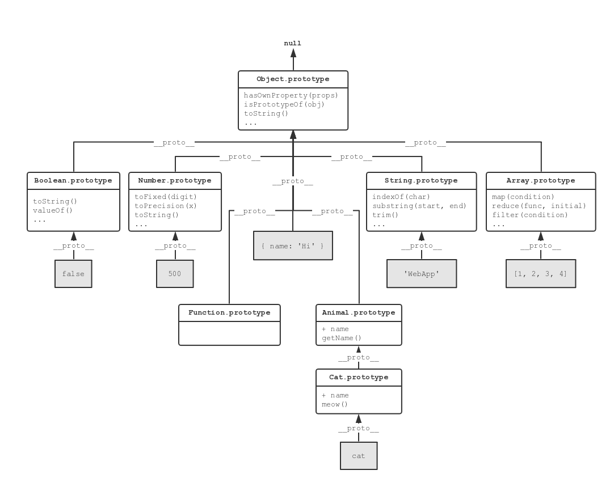
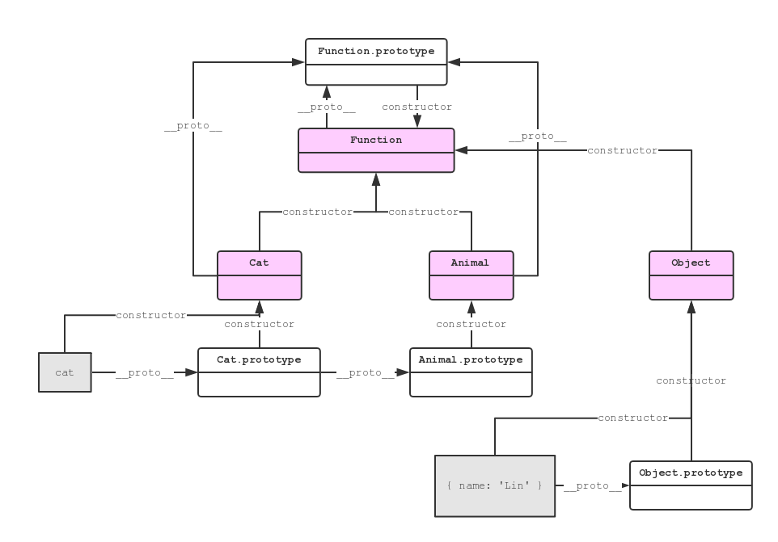
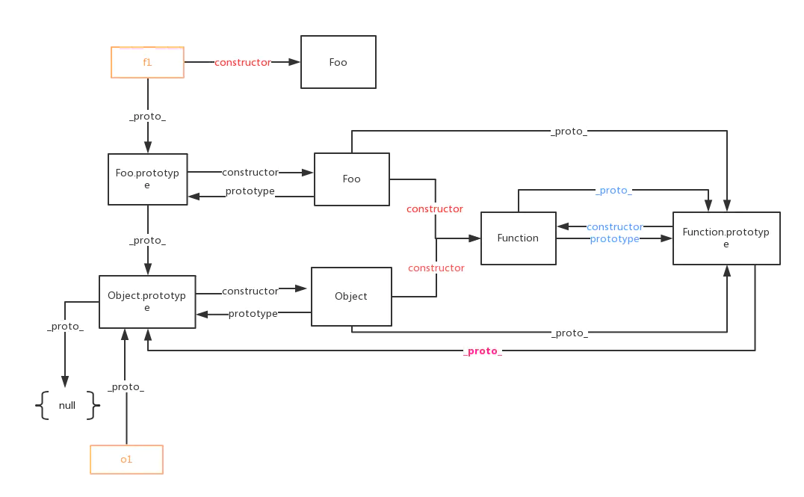

## JavaScript 原型继承之精髓

继承是为了代码复用。复用并不一定得通过类，JS 就采用了一种轻量简明的原型方案来实现。

Java/C++ 等强类型语言中有类和对象的区别，但 JS 只有对象。它的原型也是对象。

只要你完全抛开面向对象的继承思路来看 JS 的原型继承，你会发现它轻便但强大。

### 继承方案的设计要求

继承的本质是为了代码复用，代码指的是【数据+行为】的复用，将数组和数据
相关的行为进行封装
因为，如果只是复用行为，那么使用函数就足够了；而如果只是复用数据，这使用 JavaScript 对象就可以了：

```js
const parent = {
  some: "data",
};
const child = {
  ...parent,
  uniq: "data",
};
```

只有数据+行为（已经类似于一个「对象」的概念）的封装，才是继承技术所必须出现的地方。为了满足这样的代码复用，一个继承体系的设计需要支持什么需求呢？

·存储公用的数据和函数

·覆盖被继承对象数据或函数的能力

·向上查找/调用被继承对象函数的数据或函数的能力

·优雅的语法（API）

·增加新成员的能力

·支持私有数据

「支持私有数据」，这个基本所有方案都没实现，此阶段我们可以不用纠结；而「增加新成员的能力」，基本所有的方案都能做到，也不再赘述，主要来看前四点。

### 被复用的对象：prototype

```js
function Animal(name) {
  this.name = name;
  this.getName = function () {
    return this.name;
  };
}

function Cat(name, age) {
  Animal.call(this, name);
  this.age = age || 1;
  this.mewo = function () {
    return `${this.getName()}eowww~~~~~, I'm ${this.age} year(s) old`;
  };
}
const cat = new Cat('石榴'，2)
console.log(cat.mewo())
```

这个方案，具备增添新成员的能力、调用被继承对象函数的能力等。一个比较重大的缺陷是：对象的所有方法 getName meow，都会随每个实例生成一份新的拷贝。这显然不是优秀的设计方案，我们期望的结果是，继承自同一对象的子对象，其所有的方法都共享自同一个函数实例。

怎么办呢？想法也很简单，就是把它们放到同一个地方去，并且还要跟这个「对象」关联起来。如此一想，用来生成这个「对象」的函数本身就是很好的地方。我们可以把它放在函数的任一一个变量上，比如：

```js
Animal.functions.getName = function () {
  return this.name;
};
Cat.functions.meow = function () {
  return `${this.getName()}eowww~~~~~, I'm ${this.age} year(s) old`;
};
```

但这样调用起来，你就要写 animal.functions.getName()，并不方便。不要怕，JavaScript 这门语言本身已经帮你内置了这样的支持。

它内部所用来存储公共函数的变量，就是你熟知的 prototype。当你调用对象上的方法时（如 cat.getName()），它会自动去 Cat.prototype 上去帮你找 getName 函数，而你只需要写 cat.getName() 即可。兼具了功能的实现和语法的优雅。

```js
function Animal(name) {
  this.name = name;
}
Animal.prototype.getName = function () {
  return this.name;
};

function Cat(name, age) {
  Animal.call(this, name);
  this.age = age;
}
Cat.prototype = Object.create(Animal.prototype, { constructor: Cat });
Cat.prototype.meow = function () {
  return `${this.getName()}eowww~~~~~, I'm ${this.age} year(s) old`;
};
const cat = new Cat("石榴", 2);
console.log(cat.meow());
```

请注意，只有函数才有 prototype 属性，它是用来做原型继承的必需品。

### 优雅的 API：ES6 class

上面这个写法仍然并不优雅。在何处呢？一个是 prototype 这种暴露语言实现机制的关键词；一个是要命的是，这个函数内部的 this，依靠的是作为使用者的你记得使用 new 操作符去调用它才能得到正确的初始化。

但是这里没有任何线索告诉你，应该使用 new 去调用这个函数，一旦你忘记了，也不会有任何编译期和运行期的错误信息。

这样的语言特性，与其说是一个「继承方案」，不如说是一个 bug，一个不应出现的设计失误。

而这两个问题，在 ES6 提供的 class 关键词下，已经得到了非常妥善的解决，尽管它叫一个 class，但本质上其实是通过 prototype 实现的：

```js
class Animal {
  constructor(name) {
    this.name = name;
  }
  getName() {
    return this.name;
  }
}

class Cat extends Animal {
  constructor(name, age) {
    super(name);
    this.age = age;
  }
  meow() {
    return `${this.getName()}eowww~~~~~, I'm ${this.age} year(s) old`;
  }
}
```

·如果你没有使用 new 操作符，编译器和运行时都会直接报错。
·extends 关键字，会使解释器直接在底下完成基于原型的继承功能

现在，我们已经看到了一套比较完美的继承 API，也看到其底下使用 prototype 存储公共变量的地点和原理。接下来，我们要解决另外一个问题：prototype 有了，实例对象应该如何访问到它呢？这就关系到 JavaScript 的向上查找机制了

### 简明的向上查找机制

```js
function Animal(name) {
  this.name = name;
}
Animal.prototype.say = function () {
  return this.name;
};
const cat = new Animal("kitty");

console.log(cat); // Animal { name: 'kitty' }
cat.hasOwnProperty("say"); // false
```

看上面 👆 一个最简单的例子。打出来的 cat 对象本身并没有 say 方法。

那么，被实例化的 cat 对象本身，是怎样向上查找到 Animal.prototype 上的 say 方法的呢？如果你是 JavaScript 引擎的设计者，你会怎样来实现呢？

我拍脑袋这么一想，有几种方案：

在 Animal 中初始化实例对象 cat 时，顺便存取一个指向 Animal.prototype 的引用
在 Animal 中初始化实例对象时，记录其「类型」（也即是 Animal）

```js
// 方案1
function Animal(name) {
  this.name = name;
  // 以下代码由引擎自动加入
  this.__prototype__ = Animal.prototype;
}

const cat = new Animal("kitty");
cat.say(); // -> cat.__prototype__.say()

// 方案2
function Animal(name) {
  this.name = name;
  // 以下代码由引擎自动加入
  this.__type__ = Animal;
}

const cat = new Animal("kitty");
cat.say(); // -> cat.__type__.prototype.say()
```

究其实质，其实就是：实例对象需要一个指向其函数的引用（变量），以拿到这个公共原型 prototype 来实现继承方案的向上查找能力。

无独有偶，这两种方案，在 JavaScript 中都有实现，只不过变量的命名与我们的取法有所差异：第一种方案中，实际的变量名叫 **proto** 而不是 **prototype**；

第二种方案中，实际的变量名叫 constructor，不叫俗气的 **type**。

实际上，用来实现继承、做向上查找的这个引用，正是 **proto**；至于 constructor，则另有他用。不过要注意的是，尽管基本所有浏览器都支持 **proto**，它并不是规范的一部分，因此并不推荐在你的业务代码中直接使用 **proto** 这个变量。


prototype 是用来存储类型公共方法的一个对象（正因此每个类型有它基本的方法），而 **proto** 是用来实现向上查找的一个引用。任何对象都会有 **proto**。Object.prototype 的 **proto** 是 null，也即是原型链的终点。

### 构造函数

再加入 constructor 这个东西，它与 prototype、**proto** 是什么关系？这个地方，说复杂就很复杂了，让我们尽量把它说简单一些。

开始之前，我们需要查阅一下语言规范，看一些基本的定义：

·对象：对象是一组集合，其中可包含零个或多个属性。对象都有一个原型对象（译者注：即 [[Prototype]]/**proto**）

·函数：是对象类型的一员

·构造函数：构造函数是个用于创建对象的函数对象。每个构造函数都有一个 prototype 对象，用以实现原型式继承，作属性共享用

这里说明了什么呢？说明了构造函数是函数，它比普通函数多一个 prototype 属性；而函数是对象，对象都有一个原型对象 **proto**。这个东西有什么作用呢？

上节我们深挖了用于继承的原型链，它链接的是原型对象。而对象是通过构造函数生成的，也就是说，普通对象、原型对象、函数对象都将有它们的构造函数，这将为我们引出另一条链——

在 JavaScript 中，谁是谁的构造函数，是通过 constructor 来标识的。

正常来讲，普通对象（如图中的 cat 和 { name: 'Lin' } 对象）是没有 constructor 属性的，它是从原型上继承而来；


而图中粉红色的部分即是函数对象（如 Cat Animal Object 等），它们的原型对象是 Function.prototype，这没毛病。关键是，它们是函数对象，对象就有构造函数，那么函数的构造函数是啥呢？是 Function。那么问题又来了，Function 也是函数，它的构造函数是谁呢？是它自己：Function.constructor === Function。由此，Function 即是构造函数链的终结。

上面我们提到，constructor 也可以用来实现原型链的向上查找，然后它却别有他用。有个啥用呢？一般认为，它是用以支撑 instanceof 关键字实现的数据结构。

### 全貌

好了，是时候进入最烧脑的部分了。前面我们讲了两条链：

·原型链。它用来实现原型继承，最上层是 Object.prototype，终结于 null，没有循环
·构造函数链。它用来表明构造关系，最上层循环终结于 Function

把这两条链结合到一起，你就会看到一条双螺旋 DNA 这几张你经常看到却又看不懂的图：



理解了上面两条链以后，这两个全图实际上就不难理解了。分享一下，怎么来读懂这个图：

首先看构造函数链。所有的普通对象，constructor 都会指向它们的构造函数；而构造函数也是对象，它们最终会一级一级上溯到 Function 这个构造函数。Function 的构造函数是它自己，也即此链的终结；
Function 的 prototype 是 Function.prototype，它是个普通的原型对象；
其次看原型链。所有的普通对象，**proto** 都会指向其构造函数的原型对象 [Class].prototype；而所有原型对象，包括构造函数链的终点 Function.prototype，都会最终上溯到 Object.prototype，终结于 null。

也即是说，构造函数链的终点 Function，其原型又融入到了原型链中：Function.prototype -> Object.prototype -> null，最终抵达原型链的终点 null。至此这两条契合到了一起。

总结下来，可以概括成这几句话：

·JS 世界的变量除了普通类型外都是对象，包括函数也是对象

·所有对象都必须由函数生成，包括普通对象、原型对象及函数对象

·所有函数最终都生成自 Function，包括 Function 自己

·所有对象最终都继承自 Object.prototype，包括 Function.prototype，终止于 null

·这里还有最后一个所谓「鸡生蛋还是蛋生 🐔」的问题：是先有 Object.prorotype，还是先有 Function？如果先有前者，那么此时 Function 还不在，这个对象又是由谁创建呢？如果先有后者，那么 Function 也是个对象，它的原型 Function.prototype.**proto** 从哪去继承呢？这个问题，看似无解。但从 这篇文章：从 proto 和 prototype 来深入理解 JS 对象和原型链 中，我们发现了一个合理的解释，那就是：

Object.prototype 是个神之对象。它不由 Function 这个函数构造产生。

```js
Object.prototype instanceof Object; // false
Object.prototype instanceof Function; // false
Object.prototype.__proto__ === Function.prototype; // false
```

JS 对象世界的构造次序应该是：Object.prototype -> Function.prototype -> Function -> Object -> ...

### 总结

讲到这里，我想关于 JavaScript 继承中的一些基本问题可以解释清楚了：

JavaScript 继承是类继承还是原型继承？不是使用了 new 关键字么，应该跟类有关系吧？

是完全的原型继承。尽管用了 new 关键字，但其实只是个语法糖，跟类没有关系。JavaScript 没有类。它与类继承完全不同，只是长得像。好比雷锋和雷峰塔的关系。

prototype 是什么东西？用来干啥？

prototype 是个对象，只有函数上有。它是用来存储对象的属性（数据和方法）的地方，是实现 JavaScript 原型继承的基础。

**proto** 是什么东西？用来干啥？

**proto** 是个指向 prototype 的引用。用以辅助原型继承中向上查找的实现。虽然它得到了所有浏览器的支持，但并不是规范所推荐的做法。严谨地说，它是一个指向 [[Prototype]] 的引用。

constructor 是什么东西？用来干啥？

是对象上一个指向构造函数的引用。用来辅助 instanceof 等关键字的实现。

🐔 生蛋还是蛋生 🐔？

神生鸡，鸡生蛋。

## 深入 JavaScript 原型继承原理——babel 编译码解读

https://juejin.cn/post/6844903696887709709

### 无继承——简单的 class+字段声明

使用 class 关键字
并定义了一个变量

```js
class Animal(){
  constructor(name) {
    this.name = name || 'Kat'
  }
}
```

最后 babel 编译出来的代码如下。

```js
"use strict";

function _classCallCheck(instance, Constructor) {
  if (!(instance instanceof Constructor)) {
    throw new TypeError("Cannot call a class as a function");
  }
}

var Animal = function Animal(name) {
  this, Animal;

  this.name = name || "Kat";
};
```

有两个值得注意

使用 class 声明的 Animal 最后其实是被编译为一个函数。证明 class 跟类没关系，只是个语法糖。
另外
编译器帮我们插入了一个\_classCallCheck 函数调用，它会检查你有没有用 new Animal() 操作符来初始化这个函数。
若有，则 this 会是被实例化的 Animal 对象，自然能通过 animal instanceof Animal 检查；若是直接调用函数，this 会被初始化为全局对象，自然不会是 Animal 实例，从而抛出运行时错误。这个检查，正解决了提到的问题：如果忘记使用 new 去调用一个被设计构造函数的函数，没有任何运行时错误的毛病。

### 无继承——简单的 class+方法声明

给上个例子添加两个方法

```js
class Animal {
  constructor(name) {
    this.name = name || "Kat";
  }

  move() {}
  getName() {
    return this.name;
  }
}
```

编译如下

```js
"use strict";

var _createClass = (function () {
  function defineProperties(target, props) {
    for (var i = 0; i < props.length; i++) {
      var descriptor = props[i];
      descriptor.enumerable = descriptor.enumerable || false;
      descriptor.configurable = true;
      if ("value" in descriptor) descriptor.writable = true;
      Object.defineProperty(target, descriptor.key, descriptor);
    }
  }
  return function (Constructor, protoProps, staticProps) {
    if (protoProps) defineProperties(Constructor.prototype, protoProps);
    if (staticProps) defineProperties(Constructor, staticProps);
    return Constructor;
  };
})();

function _classCallCheck(instance, Constructor) {
  if (!(instance instanceof Constructor)) {
    throw new TypeError("Cannot call a class as a function");
  }
}

var Animal = (function () {
  function Animal(name) {
    _classCallCheck(this, Animal);

    this.name = name || "Kat";
  }

  _createClass(Animal, [
    {
      key: "move",
      value: function move() {},
    },
    {
      key: "getName",
      value: function getName() {
        return this.name;
      },
    },
  ]);

  return Animal;
})();
```

例子长了不少，但其实主要的变化只有两个：一是 Animal 被包了一层而不是直接返回；

二是新增的方法 move 和 getName 是通过一个 \_createClass() 方法来实现的。

它将两个方法以 key/value 的形式作为数组传入，看起来，是要把它们设置到 Animal 的原型链上面，以便后续继承之用。

为啥 Animal 被包了一层呢，这是个好问题，但答案我们将留到后文揭晓。现在，我们先看一下这个长长的 \_createClass 实现是什么：

它是个立即执行函数，执行又返回了另一个函数。说明啥，一定用了闭包，说明里面要封装些「私有」变量，那就是 defineProperties 这个函数。

这很好，一是这个函数只会生成一次，二是明确了这个函数只与 \_createClass 这个事情相关。

再细看这个返回的函数，接受 Constructor、protoProps 和 staticProps 三个参数。staticProps 我们暂时不会用到，回头再讲；我们传入的数组是通过 protoProps 接受的。

接下来，看一下 defineProperties 做了啥事。

它将每一个传进来的 props 做了如下处理：分别设置了他们的 enumerable、configurable、writable 属性。

而传进来的 target 是 Animal.prototype，相当于，这个函数最后的执行效果会是这样：

```js
function defineProperties(target, props) {
  for (var i = 0; i < props.length; i++) {
    // 前面处理其实得到这样这个 descriptor 对象：
    var descriptor = {
      ...props[i],
      enumerable: false,
      configurable: true,
      writable: true,
    };
    Object.defineProperty(target, descriptor.key, descriptor);
  }
}
```

看到这里就很明白了，它就是把你定义的 move、getName 方法通过 Object.defineProperty 方法设置到 Animal.prototype 上去。

前面我们说过，prototype 是用来存储公共属性的。也就是说，这两个方法在你使用继承的时候，可以被子对象通过原型链上溯访问到。

也就是说，我们这个小小的例子里，声明的两个方法已经具备了继承能力了。

至于 enumerable、configurable、writable 属性是什么东西呢，查一下语言规范就知道了。

简单来说，writable 为 false 时，其值不能通过 setter 改变；enumerable 为 false 时，不能出现在 for-in 循环中。当然，这里是粗浅的理解，暂时不是这篇文章的重点。

### 简单继承——一层继承 + 字段覆盖

```js
class Animal {
  constructor(name) {
    this.name = name || "Kat";
  }
}

class Tiger extends Animal {
  constructor(name, type) {
    super(name);
    this.type = type || "Paper";
  }
}
```

加一层继承和字段覆盖能看到啥东西呢？能看到继承底下的实现机制是怎么样的，以及它的 constructor 和 **proto** 属性将如何被正确设置。

带着这两个问题，我们一起来看下编译后的源码：

```js
"use strict";

function _possibleConstructorReturn(self, call) {
  if (!self) {
    throw new ReferenceError(
      "this hasn't been initialised - super() hasn't been called"
    );
  }
  return call && (typeof call === "object" || typeof call === "function")
    ? call
    : self;
}

function _inherits(subClass, superClass) {
  if (typeof superClass !== "function" && superClass !== null) {
    throw new TypeError(
      "Super expression must either be null or a function, not " +
        typeof superClass
    );
  }
  subClass.prototype = Object.create(superClass && superClass.prototype, {
    constructor: {
      value: subClass,
      enumerable: false,
      writable: true,
      configurable: true,
    },
  });
  if (superClass)
    Object.setPrototypeOf
      ? Object.setPrototypeOf(subClass, superClass)
      : (subClass.__proto__ = superClass);
}

function _classCallCheck(instance, Constructor) {
  if (!(instance instanceof Constructor)) {
    throw new TypeError("Cannot call a class as a function");
  }
}

var Animal = function Animal(name) {
  _classCallCheck(this, Animal);

  this.name = name || "Kat";
};

var Tiger = (function (_Animal) {
  _inherits(Tiger, _Animal);

  function Tiger(name, type) {
    _classCallCheck(this, Tiger);

    var _this = _possibleConstructorReturn(
      this,
      (Tiger.__proto__ || Object.getPrototypeOf(Tiger)).call(this, name)
    );

    _this.type = type || "Paper";
    return _this;
  }

  return Tiger;
})(Animal);
```

相比无继承的代码，这里主要增加了几个函数。\_possibleConstructorReturn 顾名思义，可能不是很重要，回头再读。精华在 \_inherits(Tiger, Animal) 这个函数，我们按顺序来读一下。首先是一段异常处理，简单地检查了 superClass 要么是个函数，要么得是个 null。也就是说，如果你这样写那是不行的：

```js
const Something = "not-a-function";
class Animal extends Something {}
// Error: Super expression must either be null or a function, not string
```

接下来这句代码将 prototype 和 constructor 一并设置到位，是精华。注意，这个地方留个问题：为什么要用 Object.create(superClass.prototype)，而不是直接这么写：

```js
function _inherits(subClass, superClass) {
  subClass.prototype = superClass && superClass.prototype
  subClass.prototype.constructor = { ... }
}

```

很明显，是为了避免任何对 subClass.prototype 的修改影响到 superClass.prototype。使用 Object.create(asPrototype) 出来的对象，其实上是将 subClass.prototype.**proto** = superClass.prototype，这样 subClass 也就继承了 superClass，可以达到这样两个目的：
1、当查找到 subClass 上没有的属性时，会自动往 superClass 上找；这样 superClass.prototype 原型上发生的修改都能实时反映到 subClass 上

2、subClass.prototype 本身是个新的对象，可以存放 subClass 自己的属性，这样 subClass.prototype 上的任何修改不会影响到 superClass.prototype

最后，如果 superClass 不为空，那么将 subClass.**proto** 设置为 superClass。这点我并不是很理解。

至此，一个简单的继承就完成了。在使用了 extends 关键字后，实际上背后发生的事情是：

子「类」prototype 上的 **proto** 被正确设置，指向父「类」的 prototype: subClass.prototype = { **proto**: superClass.prototype }

子「类」prototype 上的 constructor 被正确初始化，这样 instanceof 关系能得到正确结果

### 无继承——静态函数

看一个简单的代码：

```js
class Animal {
  static create() {
    return new Animal();
  }
}
```

首先要知道，这个「静态」同样不是强类型类继承语言里有的「静态」的概念。所谓静态，就是说它跟实例是没关系的，而跟「类」本身有关系。比如，你可以这样调用：Animal.create()，但不能这样用：new Animal().create。什么场景下会用到这种模式呢？比如说：
1、工厂模式或单例模式
2、Object.create、Object.keys 等常用方法
既然只有通过构造函数本身去调用，而不能通过实例来调用，期望它们被绑定到函数本身上似乎很自然。我们来看看上面这段代码将被如何编译：

```js
"use strict";

var _createClass = (function () {
  function defineProperties(target, props) {
    for (var i = 0; i < props.length; i++) {
      var descriptor = props[i];
      descriptor.enumerable = descriptor.enumerable || false;
      descriptor.configurable = true;
      if ("value" in descriptor) descriptor.writable = true;
      Object.defineProperty(target, descriptor.key, descriptor);
    }
  }
  return function (Constructor, protoProps, staticProps) {
    if (protoProps) defineProperties(Constructor.prototype, protoProps);
    if (staticProps) defineProperties(Constructor, staticProps);
    return Constructor;
  };
})();

function _classCallCheck(instance, Constructor) {
  if (!(instance instanceof Constructor)) {
    throw new TypeError("Cannot call a class as a function");
  }
}

var Animal = (function () {
  function Animal() {
    _classCallCheck(this, Animal);
  }

  _createClass(Animal, null, [
    {
      key: "create",
      value: function create() {},
    },
  ]);

  return Animal;
})();
```

熟悉的函数，熟悉的配方。与本文的第二个例子相比，仅有一个地方的不同：create 方法是作为 \_createClass 方法的第三个参数被传入的，这正是我们上文提到的 staticProps 参数：

```js
var _createClass = (function() {
  function defineProperties(target, props) { ... }

  return function(Constructor, protoProps, staticProps) {
    if (protoProps) defineProperties(Constructor.prototype, protoProps)
    if (staticProps) defineProperties(Constructor, staticProps)
    return Constructor
  }
})()

_createClass(Animal, null, [
  {
    key: 'create',
    value: function create() {},
  },
])

```

可以看见，create 方法是直接被创建到 Animal 上的：defineProperties(Animal, [{ key: 'create', value: function() {} }])，最终会将函数赋给 Animal.create。我们的猜测并没有错误。

### 无继承——静态变量

```js
class Tiger {
  static TYPE = "REAL";
}
```

还有个小例子。如果是静态变量的话，同样因为不希望在实例对象上所使用，我们会看到编译出来的代码中它是直接被设置到函数上。代码已经很熟悉，不必再讲。

```js
"use strict";

function _classCallCheck(instance, Constructor) {
  if (!(instance instanceof Constructor)) {
    throw new TypeError("Cannot call a class as a function");
  }
}

var Tiger = function Tiger() {
  _classCallCheck(this, Tiger);
};

Tiger.TYPE = "REAL";
```
