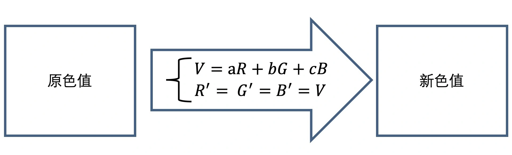
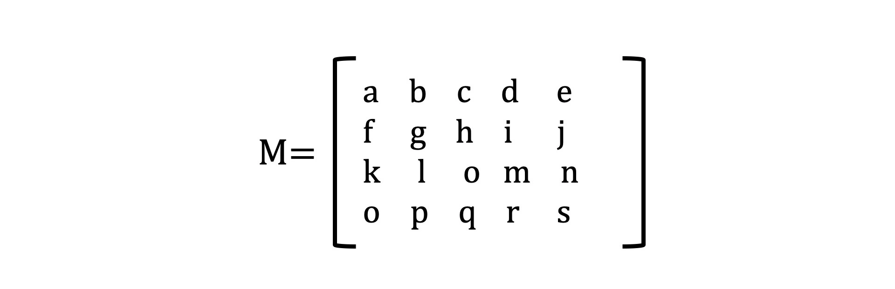
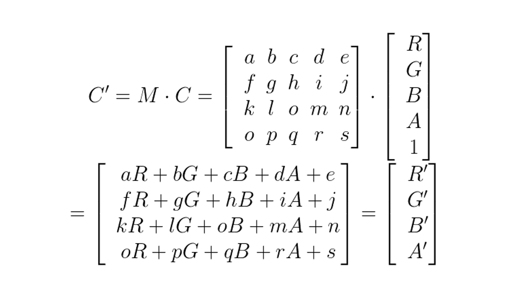
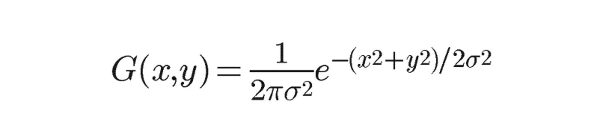

# 1、双向数据绑定

```js
let a = document.createElement("div");
a.setAttribute("id", "a");
document.body.appendChild(a);
let b = document.createElement("div");
b.setAttribute("id", "b");
document.body.appendChild(b);
let data = {
  a: 1,
  b: 2,
};
// let arr = [1, 2, 3, 4];
// arr[0] = 2;
// array.prototype.splice;
//发布
class Dep {
  constructor() {
    this.callBack = [];
  }
  depend(watch) {
    this.callBack.push(watch);
  }
  notify(nVal) {
    this.callBack.forEach((watch) => {
      watch.update(nVal);
    });
  }
}
//订阅
class Watch {
  constructor(key) {
    this.dom = document.getElementById(key);
  }
  update(nVal) {
    this.dom.innerHTML = nVal;
  }
}
Object.keys(data).forEach((key) => {
  let dep = new Dep();
  Object.defineProperty(data, key, {
    get: function () {
      let watch = new Watch(key);
      dep.depend(watch);
    },
    set: function (nVal) {
      dep.notify(nVal);
    },
  });
});
```

```html
<ul id="list">
  <li class="demo" style="">2222</li>
  <li class="demo">123</li>
  <li class="demo">2333</li>
</ul>
```

```js
let Vdom = {
  tagName: "ul",
  props: {
    id: "list",
  },
  children: [
    {
      tagName: "li",
      props: {
        class: "item",
      },
      text: "123",
    },
  ],
};
```

```shell
虚拟dom的算法=虚拟dom + diff算法
虚拟dom损耗 = 虚拟dom的增删改查+真实dom增删改查+部分的重绘回流
真实dom损耗 = 真实dom增删改查+所需部分的重绘回流
```

```js

const patch={
  TEXT:1,   //0001
  CLASS:1<<1,//0010
  STYLE:1<<2,//0100
  PROPS:1<<3,//1000
}

const flag1 = patch.TEXT | patch.STYLE //0101
flag1 & patch.TEXT 1
flag1 & patch.CLASS 0

```

# 2、最长递增子序列

```js
var lengthOfLIS = function (nums) {
  if (nums.length === 0) {
    return 0;
  }
  let dp = new Array(nums.length).fill(1); // dp[i]表示i之前最长上升子序列长度
  let max = dp[0];
  for (let i = 0; i < nums.length; i++) {
    //求出所有长度的dp
    for (let j = 0; j < i; j++) {
      // dp[i] = max(dp[j] + 1,dp[i])  j<i 如果nums[j] < nums[i] 则nums[i] 可以放在dp[j]后面，长度增加1，
      if (nums[j] < nums[i]) {
        dp[i] = Math.max(dp[j] + 1, dp[i]);
        max = Math.max(max, dp[i]);
      }
    }
  }
  return max;
};
```

## 简单 diff

```js
let utils = {
  /**
   * 比较两个json（新json与老json）的不同,并返回 不同时的旧值(old_val)和新值(new_val)
   * @param {*} json1 老json
   * @param {*} json2 新json
   */
  diff(json1, json2) {
    if (
      !json1 ||
      this.isEmptyObject(json1) ||
      !json2 ||
      this.isEmptyObject(json2)
    ) {
      return null;
    }
    let diffRes = {
      old_val: {},
      new_val: {},
    };
    for (let k in json2) {
      // 判断数据类型是否一致
      if (this.getTypeByObj(json2[k]) === this.getTypeByObj(json1[k])) {
        // 比较 “Array”和“Object”类型
        if (
          this.getTypeByObj(json2[k]) === "Array" ||
          this.getTypeByObj(json2[k]) === "Object"
        ) {
          const diffData = this.diff(json1[k], json2[k]);
          if (!this.isEmptyObject(diffData)) {
            diffRes.old_val[k] = diffData.old_val;
            diffRes.new_val[k] = diffData.new_val;
          }
        } else if (json1[k] !== json2[k]) {
          // 比较其他类型数据
          diffRes.old_val[k] = json1[k];
          diffRes.new_val[k] = json2[k];
        }
      } else {
        diffRes.old_val[k] = json1[k];
        diffRes.new_val[k] = json2[k];
      }
    }
    // 若没有变化，返回null
    if (
      this.isEmptyObject(diffRes.old_val) ||
      this.isEmptyObject(diffRes.new_val)
    ) {
      return null;
    }
    return diffRes;
  },
  /**
   * 获取数据类型
   * @param {*} obj
   */
  getTypeByObj(obj) {
    return Object.prototype.toString
      .call(obj)
      .match(/^\[object ([a-zA-Z]*)\]$/)[1];
  },
  /**
   * 判断是否是空对象
   * @param {*} obj
   */
  isEmptyObject(obj) {
    for (var key in obj) {
      return false;
    }
    return true;
  },
};
let obj1 = {
  name: "jack",
  age: 18,
  title: "这是标题",
  lv2: {
    tip: "这是二层提示",
    lv3: {
      noC: "noC",
      msg: "这是三层msg",
    },
  },
};
let obj2 = {
  name: "jack",
  age: 188,
  title: "这是标题1",
  lv2: {
    tip: "这是二层提示",
    lv3: {
      noC: "noC",
      msg: "这是三层msg1",
    },
  },
  no: "这是obj1没有的",
};
console.log(utils.diff(obj1, obj2));
```

```shell
1、业务
  1.1业务数据
  1.2业务逻辑
  1.3逻辑数据
  1.4视图数据
  1.5视图展示 通过逻辑数据转换去处理展示视图 接口的定义是需要前端接入
  1.6视图的逻辑

2、接口设计
  接口是否具有可复用性、接口的字段返回是否冗余、接口是否有必要拆分整合。前端的保证接口出错以后展示。

3、标准
TTL\ 首次可交互时间
FID\ 首次输入延迟
TBT\ 阻塞时间
FP\  首次绘制
FCP\ 首次内容绘制
LCP\ 最大内容绘制
CLS\ 累计位移偏移
```

# 3、compiler

虚拟 dom 从哪来
词法分析-》语义分析-》AST->transform->generate

```js
function compiler(template) {
  const ast = parse(template);
  transform(ast);
  const code = generate(ast);
  return code;
}

let template = `<div id="app">
    <div @click="()=>console.log(xx)" :id="name">{{name}}</div>
    <h1 :name="title">玩转vue3</h1>
    <p >编译原理</p>
</div>`;

const render = compiler(template);
```

```js
[
  { type: "start", val: "div" },
  { type: "props", val: 'id="app"' },
];
```

```js
function tokenizer(input) {
  let tokens = [];
  let type = "";
  let val = "";

  for (let i = 0; i < input.length; i++) {
    let ch = input[i];
    if (ch === "<") {
      push();
      if (input[i + 1] === "/") {
        type = "tagend";
      } else {
        type = "tagstart";
      }
    }
    if (ch === ">") {
      if (input[i - 1] == "=") {
        // 箭头函数
      } else {
        push();
        type = "text";
        continue;
      }
    } else if (/[\s]/.test(ch)) {
      push();
      type = "props";
      continue;
    }
    val += ch;
  }
  return tokens;

  function push() {
    if (val) {
      if (type === "tagstart") val = val.slice(1); // <div  => div
      if (type === "tagend") val = val.slice(2); //</div => div
      tokens.push({ type, val });
      val = "";
    }
  }
}
```

```js
function parse(template) {
  const tonkens = tokenizer(template);
  let cur = 0;
  let ast = {
    type: "root",
    props: [],
    children: [],
  };
  while (cur < tonkens.length) {
    ast.children.push(walk());
  }
  return ast;

  function walk() {
    let token = tonkens[cur];
    if (token.type === "tagstart") {
      let node = {
        type: "element",
        tag: token.val,
        props: [],
        children: [],
      };
      token = tonkens[++cur];

      while (token.type !== "tagend") {
        if (token.type === "props") {
          node.props.push(walk());
        } else {
          node.children.push(walk());
        }
        token = tonkens[cur];
      }
      cur++;
      return node;
    }
    if (token.type === "tagend") {
      cur++;
    }
    if (token.type === "text") {
      cur++;
      return token;
    }
    if (token.type === "props") {
      cur++;
      const [key, val] = token.val.replace("=", "~").split("~");
      return {
        key,
        val,
      };
    }
  }
}
```

# 4、eventloop

```js
function foo() {
  // foo()
  // setTimeout(foo(), 0);
  return Promise.resolve().then(foo);
}
foo();
```

# 5、前端可视化

## 图形基础

### HTML/CSS

### SVG

```js

 <!--
      dataset = {
        total: [25, 26, 40, 45, 68],
        current: [15, 11, 17, 25, 37],
      }
  -->
  <svg xmlns="http://www.w3.org/2000/svg" width="120px" height="240px" viewBox="0 0 60 100">
    <g transform="translate(0, 100) scale(1, -1)">
      <g>
        <rect x="1" y="0" width="10" height="25" fill="#37c"/>
        <rect x="13" y="0" width="10" height="26" fill="#37c"/>
        <rect x="25" y="0" width="10" height="40" fill="#37c"/>
        <rect x="37" y="0" width="10" height="45" fill="#37c"/>
        <rect x="49" y="0" width="10" height="68" fill="#37c"/>
      </g>
      <g>
        <rect x="1" y="0" width="10" height="15" fill="#3c7"/>
        <rect x="13" y="0" width="10" height="11" fill="#3c7"/>
        <rect x="25" y="0" width="10" height="17" fill="#3c7"/>
        <rect x="37" y="0" width="10" height="25" fill="#3c7"/>
        <rect x="49" y="0" width="10" height="37" fill="#3c7"/>
      </g>
    </g>
  </svg>
```

### canvas2D

### webGl

基于 OpenGL ES
第一种 多 你要绘制的图形内容非常多

第二种 像素 对图像细节的像素处理

第三种 3D

底层实现原理

    生成数据经过cpu,cpu生成特定的几何信息，信息送至GPU，GPU经过两个步骤生成光栅信息，光栅信息输出到帧缓存，最后渲染。
    渲染管线

cpu 处理大型任务

webGL 绘制图形

    1、创建WebGl上下文
    2、创建WebGL程序    着色器 GLSL
    3、将数据存入缓冲区
    4、缓冲区的数据读取到gpu
    5、GPU执行webGL程序
    6、输出结果

创建 WebGl 上下文

```js
const canvas = document.querySelector("canvas");
const gl = canvas.getContext("webgl");
```

创建 WebGL 程序
顶点、图元

```js
const vertex = `
    attribute vec2 position
    void main(){
      gl_position =1.0;
      gl_position = vec4(position,1.0,1.0)
    }
  `;
const fragment = `
    precision mediump float;
    void main(){
      gl_FragColor = vec4(1.0,0.0,0.0,1.0)
    }
  `;
```

将数据存入缓冲区
(0,0,0)
(-1,-1),(1,-1)(0,1)

```js
const points = new Float32Array([-1, -1, 0, 1, 1, -1]);
const bufferId = gl.createBuffer();
gl.bindBuffer(gl.ARRAY_BUFFER, bufferId);
gl.bufferData(gl.ARRAY_BUFFER, points, gl.STATIC_DRAW);
```

缓冲区的数据读取到 gpu

```js
const vPosition = sl.getAttribLocation(program, "position");
gl.vertexAttribPointer(vPosition, 2, gl.Float, false, 0, 0);
gl.enabledVertexAttribArray(vPosition);
```

## 数学基础

### 向量和矩阵运算

### 参数方程

### 三角剖分

### 仿射变换

## 性能优化

## 视觉呈现

# 6、灰度滤镜与高斯模糊

0.2126、0.7152 0.0722

图片亮度

我们创建一个 4\*5 颜色矩阵，让它的第一行决定红色通道，第二行决定绿色通道，第三行决定蓝色通道，第四行决定 Alpha 通道。

那如果要改变一个像素的颜色效果，我们只需要将该矩阵与像素的颜色向量相乘就可以了。

高斯计算公式


# 7、《HTTP 演变（主要针对队头阻塞讨论）》

# 8、VUE VS REACT

## 数据驱动页面的不同方式

- Angular 1：脏检查
- React:虚拟 dom
  fiber->链表

```js
<div id="app">
  <p class="item">Item1</p>
  <div class="item">Item2</div>
</div>
```

```json
{
  "tag": "div",
  "attrs": {
    "id": "app"
  },
  "children": [
    {
      "tag": "p",
      "attrs": { "className": "item" },
      "children": ["Item1"]
    },
    {
      "tag": "div",
      "attrs": { "className": "item" },
      "children": ["Item2"]
    }
  ]
}
```

### vue 数据驱动进化史

#### 一些新的特性

- RFC 机制 https://github.com/vuejs/rfcs
- 响应式系统
- 自定义渲染器
- TS
- Composition API 组合语法
- 新的组件
- vite

## JSX VS TEMPLATE

https://vue-next-template-explorer.netlify.app/#eyJzcmMiOiI8ZGl2IGlkPVwiYXBwXCI+XG4gICAgPGRpdiBAY2xpY2s9XCIoKT0+Y29uc29sZS5sb2coeHgpXCIgIG5hbWU9XCJoZWxsb1wiPnt7bmFtZX19PC9kaXY+XG4gICAgPGgxID7mioDmnK/mkbjpsbw8L2gxPlxuICAgIDxwIDppZD1cIm5hbWVcIiBjbGFzcz1cImFwcFwiPuaRuOmxvOaXtumXtDwvcD5cbjwvZGl2PlxuIiwic3NyIjpmYWxzZSwib3B0aW9ucyI6eyJob2lzdFN0YXRpYyI6dHJ1ZSwiY2FjaGVIYW5kbGVycyI6dHJ1ZSwib3B0aW1pemVCaW5kaW5ncyI6ZmFsc2V9fQ==

```js
// patchFlags 字段类型列举
export const enum PatchFlags {
  TEXT = 1,   // 动态文本内容
  CLASS = 1 << 1,   // 动态类名
  STYLE = 1 << 2,   // 动态样式
  PROPS = 1 << 3,   // 动态属性，不包含类名和样式
  FULL_PROPS = 1 << 4,   // 具有动态 key 属性，当 key 改变，需要进行完整的 diff 比较
  HYDRATE_EVENTS = 1 << 5,   // 带有监听事件的节点
  STABLE_FRAGMENT = 1 << 6,   // 不会改变子节点顺序的 fragment
  KEYED_FRAGMENT = 1 << 7,   // 带有 key 属性的 fragment 或部分子节点
  UNKEYED_FRAGMENT = 1 << 8,   // 子节点没有 key 的fragment
  NEED_PATCH = 1 << 9,   // 只会进行非 props 的比较
  DYNAMIC_SLOTS = 1 << 10,   // 动态的插槽
  HOISTED = -1,   // 静态节点，diff阶段忽略其子节点
  BAIL = -2   // 代表 diff 应该结束
}
```
