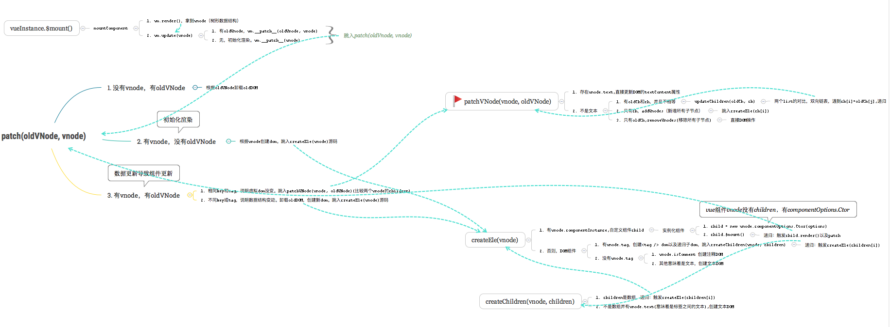
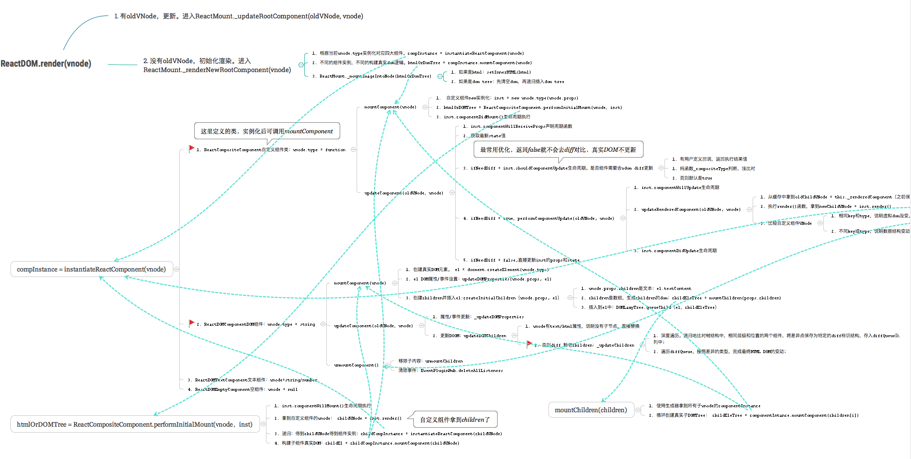

### VUE 与 React 的区别

个人理解 当你登陆 vue 官网时他的介绍是渐进式 JavaScript 框架，而 react 是用于构建用户界面的 JavaScript 库。即 react 的定位并不是框架。是不是框架意味着是否对你写的代码具有侵入性。即 vue 会改变你的写法，而 react 会保住 js 的味道。

#### 相同点

1、都使用虚拟 dom
2、使用组件化思想，流程基本一致
3、都是响应，推崇单项数据流
4、支持服务端渲染
Vue 和 React 实现原理和流程基本一致，都是使用 Virtual DOM + Diff 算法。不管是 Vue 的 template 模板 + options api 写法，还是 React 的 Class 或者 Function（js 的 class 写法也是 function 函数的一种）写法，底层最终都是为了生成 render 函数，render 函数执行返回 VNode（虚拟 DOM 的数据结构，本质上是棵树）。

Vue 和 React 通用流程：vue template/react jsx -> render 函数 -> 生成 VNode -> 当有变化时，新老 VNode diff -> diff 算法对比，并真正去更新真实 DOM。
核心还是 Virtual DOM，为什么 Vue 和 React 都选择 Virtual DOM（React 首创 VDOM，Vue2.0 开始引入 VDOM）？，个人认为主要有以下几点：

1、减少直接操作 DOM。框架给我们提供了屏蔽底层 dom 书写的方式，减少频繁的整更新 dom，同时也使得数据驱动视图
2、为函数式 UI 编程提供可能（React 核心思想）
3、可以跨平台，渲染到 DOM（web）之外的平台。比如 ReactNative，Weex

#### 不同点

1、核心思想不同
1.1 核心思想不同导致写法差异
Vue 推崇 template（简单易懂，从传统前端转过来易于理解）、单文件 vue。而且虽然 Vue2.0 以后使用了 Virtual DOM，使得 Vue 也可以使用 JSX（bebel 工具转换支持），但 Vue 官方依然首先推荐 template，这跟 Vue 的核心思想和定位有一定关系。

React 推崇 JSX、HOC、all in js。

1.2 核心思想不同导致 api 差异
Vue 定位简单易上手，基于 template 模板 + options API，所以不可避免的有较多的概念和 api。比如 template 模板中需要理解 slot、filter、指令等概念和 api，options API 中需要理解 watch、computed（依赖收集）等概念和 api。

React 本质上核心只有一个 Virtual DOM + Diff 算法，所以 API 非常少，知道 setState 就能开始开发了。

1.3 核心思想不同导致社区差异
由于 Vue 定义简单易上手，能快速解决问题，所以很多常见的解决方案，是 Vue 官方主导开发和维护。比如状态管理库 Vuex、路由库 Vue-Router、脚手架 Vue-CLI、Vutur 工具等。属于那种大包大揽，遇到某类通用问题，只需要使用官方给出的解决方案即可。

React 只关注底层，上层应用解决方案基本不插手，连最基础的状态管理早期也只是给出 flow 单向数据流思想，大部分都丢给社区去解决。比如状态管理库方面，有 redux、mobx、redux-sage、dva 等一大堆（选择困难症犯了），所以这也造就了 React 社区非常繁荣。同时由于有社区做上层应用解决方案，所以 React 团队有更多时间专注于底层升级。

2、组件实现不同
Vue 源码实现是把 options 挂载到 Vue 核心类上，然后再 new Vue({options})拿到实例（vue 组件的 script 导出的是一个挂满 options 的纯对象而已）。所以 options api 中的 this 指向内部 Vue 实例，对用户是不透明的，所以需要文档去说明 this.$slot、this.$xxx 这些 api。另外 Vue 插件都是基于 Vue 原型类基础之上建立的，这也是 Vue 插件使用 Vue.install 的原因，因为要确保第三方库的 Vue 和当前应用的 Vue 对象是同一个。

React 内部实现比较简单，直接定义 render 函数以生成 VNode，而 React 内部使用了四大组件类包装 VNode，不同类型的 VNode 使用相应的组件类处理，职责划分清晰明了（后面的 Diff 算法也非常清晰）。React 类组件都是继承自 React.Component 类，其 this 指向用户自定义的类，对用户来说是透明的。

3. 响应式原理不同
   这个问题网上已经有许多优秀文章都详细讲解过，这里就不具体展开讲，对 Vue3 响应式原理，都是基于依赖收集，不同的是 Vue3 使用 Proxy)。

Vue

Vue 依赖收集，自动优化，数据可变。
Vue 递归监听 data 的所有属性,直接修改。
当数据改变时，自动找到引用组件重新渲染。
React

React 基于状态机，手动优化，数据不可变，需要 setState 驱动新的 State 替换老的 State。
当数据改变时，以组件为根目录，默认全部重新渲染

4. diff 算法不同
   两者流程思维上是类似的，都是基于两个假设（使得算法复杂度降为 O(n)）：

不同的组件产生不同的 DOM 结构。当 type 不相同时，对应 DOM 操作就是直接销毁老的 DOM，创建新的 DOM。
同一层次的一组子节点，可以通过唯一的 key 区分。
但两者源码实现上有区别：

Vue 基于 snabbdom 库，它有较好的速度以及模块机制。Vue Diff 使用双向链表，边对比，边更新 DOM。

React 主要使用 diff 队列保存需要更新哪些 DOM，得到 patch 树，再统一操作批量更新 DOM。

5. 事件机制不同
   Vue

Vue 原生事件使用标准 Web 事件
Vue 组件自定义事件机制，是父子组件通信基础
Vue 合理利用了 snabbdom 库的模块插件
React

React 原生事件被包装，所有事件都冒泡到顶层 document 监听，然后在这里合成事件下发。基于这套，可以跨端使用事件机制，而不是和 Web DOM 强绑定。
React 组件上无事件，父子组件通信使用 props
#Vue 和 React 源码流程图

