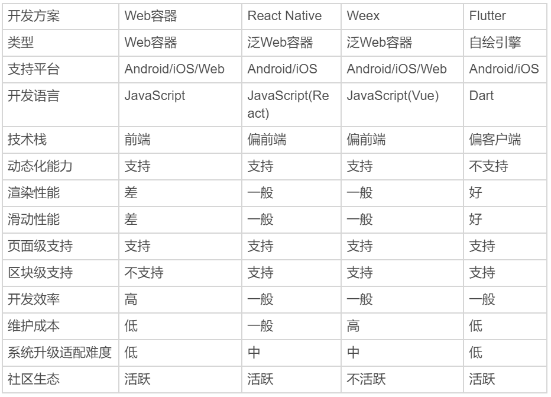
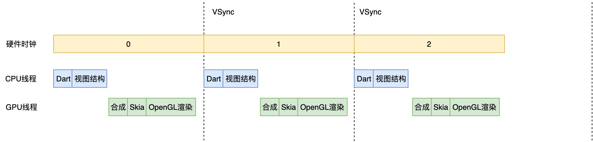
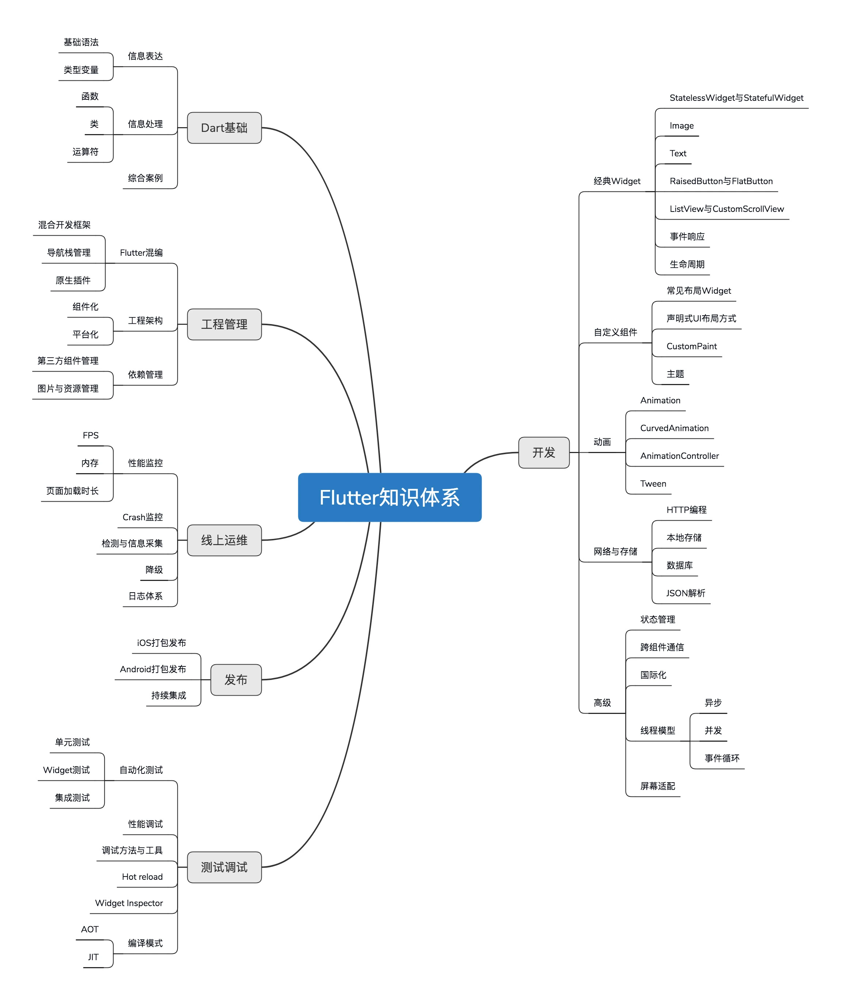

# 跨平台方案的历史发展逻辑

    对于企业来说，移动应用已然成为各类手机终端上一张必备的产品名片。在移动互联网的浪潮下，我们开发的应用要想取胜，开发效率和使用体验可以说是同等重要。但是，使用原生的方式来开发 App，就要求我们必须针对 iOS 和 Android 这两个平台分别开发，这对于中小型团队来说就是隐患和额外的负担。

我们需要在不同的项目间尝试用不同的语言去实现同样的功能，还要承担由此带来的维护任务。如果还要继续向其他平台（比如 Web、Mac 或 Windows）拓展的话，我们需要付出的成本和时间将成倍增长。而这，显然是难以接受的。于是，跨平台开发的概念成为了首选。

所以从本质上讲，跨平台开发是为了增加业务代码的复用率，减少因为要适配多个平台带来的工作量，从而降低开发成本。在提高业务专注度的同时，能够为用户提供一致的用户体验。用一个词来概括这些好处的话，就是“多快好省”。

“一次编码，到处运行”。二十多年前 Java 正是以跨平台特性的口号登场，击败了众多竞争对手。这个口号，意味着 Java 可以在任何平台上进行开发，然后编译成一段标准的字节码后，就可以运行在任何安装有 Java 虚拟机（JVM）的设备上。虽然现在跨平台已经不是 Java 的最大优势（而是它繁荣的生态），但不可否认它当年打着跨平台旗号横空出世确实势不可挡。

而对于移动端开发来讲，如果能实现“一套代码，多端运行”，这样的技术势必会引发新的生产力变革，在目前多终端时代的大环境下，可以为企业节省人力资源上，从而带来直接的经济效益。
所以在这里考虑的
跨平台开发方案
如无特殊说明
指的是跨 ios 与安卓端

## 跨平台开发方案的三个时代

根据实现方式的不同，业内常见的观点是将主流的跨平台方案划分为三个时代。

- Web 容器时代：基于 Web 相关技术通过浏览器组件来实现界面及功能，典型的框架包括 Cordova(PhoneGap)、Ionic 和微信小程序。
- 泛 Web 容器时代：采用类 Web 标准进行开发，但在运行时把绘制和渲染交由原生系统接管的技术，代表框架有 React Native、Weex 和快应用，广义的还包括天猫的 Virtual View 等。
- 自绘引擎时代：自带渲染引擎，客户端仅提供一块画布即可获得从业务逻辑到功能呈现的多端高度一致的渲染体验。Flutter，是为数不多的代表。接下来，我们先看一下目前使用最广泛的 Web 容器方案。

## Web 容器时代 Web

主要采用的是原生应用内嵌浏览器控件 WebView（iOS 为 UIWebView 或 WKWebView，Android 为 WebView）的方式进行 HTML5 页面渲染，并定义 HTML5 与原生代码交互协议，将部分原生系统能力暴露给 HTML5，从而扩展 HTML5 的边界。这类交互协议，就是我们通常说的 JS Bridge（桥）。这种开发模式既有原生应用代码又有 Web 应用代码，因此又被称为 Hybrid 开发模式。由于 HTML5 代码只需要开发一次，就能同时在多个系统运行，因此大大降低了开发成本。由于采用了 Web 开发技术，社区和资源非常丰富，开发效率也很高。但，一个完整 HTML5 页面的展示要经历浏览器控件的加载、解析和渲染三大过程，性能消耗要比原生开发增加 N 个数量级。

- 浏览器控件加载 HTML5 页面的 HTML 主文档；
- 加载过程中遇到外部 CSS 文件，浏览器另外发出一个请求，来获取 CSS 文件；
- 遇到图片资源，浏览器也会另外发出一个请求，来获取图片资源。这是异步请求，并不会影响 HTML 文档的加载。
- 加载过程中遇到 JavaScript 文件，由于 JavaScript 代码可能会修改 DOM 树，因此 HTML 文档会挂起渲染（加载解析渲染同步）的线程，直到 JavaScript 文件加载解析并执行完毕，才可以恢复 HTML 文档的渲染线程。
- JavaScript 代码中有用到 CSS 文件中的属性样式，于是阻塞，等待 CSS 加载完毕才能恢复执行。
  而这，只是完成 HTML5 页面渲染的最基础的加载过程。加载、解析和渲染这三个过程在实际运行时又不是完全独立的，还会有交叉。也就是说，会存在一边加载，一边解析，一边渲染的现象。这，就使得页面的展示并不像想象中那么容易。

## 泛 Web 容器时代

虽然 Web 容器方案具有生态繁荣、开发体验友好、生产效率高、跨平台兼容性强等优势，但它最大的问题在于承载着大量 Web 标准的 Web 容器过于笨重，以至于性能和体验都达不到与原生同样的水准，在复杂交互和动画上较难实现出优良的用户体验。
泛 Web 容器时代的解决方案优化了 Web 容器时代的加载、解析和渲染这三大过程，把影响它们独立运行的 Web 标准进行了裁剪，以相对简单的方式支持了构建移动端页面必要的 Web 标准（如 Flexbox 等），也保证了便捷的前端开发体验；同时，这个时代的解决方案基本上完全放弃了浏览器控件渲染，而是采用原生自带的 UI 组件实现代替了核心的渲染引擎，仅保持必要的基本控件渲染能力，从而使得渲染过程更加简化，也保证了良好的渲染性能。
也就是说，在泛 Web 容器时代，我们仍然采用前端友好的 JavaScript 进行开发，整体加载、渲染机制大大简化，并且由原生接管绘制，即将原生系统作为渲染的后端，为依托于 JavaScript 虚拟机的 JavaScript 代码提供所需要的 UI 控件的实体。这，也是现在绝大部分跨平台框架的思路，而 React Native 和 Weex 就是其中的佼佼者。

## 自绘引擎时代

泛 Web 容器时代使用原生控件承载界面渲染，固然解决了不少性能问题，但同时也带来了新的问题。抛开框架本身需要处理大量平台相关的逻辑外，随着系统版本变化和 API 的变化，我们还需要处理不同平台的原生控件渲染能力差异，修复各类奇奇怪怪的 Bug。始终需要 Follow Native 的思维方式，就使得泛 Web 容器框架的跨平台特性被大打折扣。
而这一时期的代表 Flutter 则开辟了一种全新的思路，即从头到尾重写一套跨平台的 UI 框架，包括渲染逻辑，甚至是开发语言。

- 渲染引擎依靠跨平台的 Skia 图形库来实现，Skia 引擎会将使用 Dart 构建的抽象的视图结构数据加工成 GPU 数据，交由 OpenGL 最终提供给 GPU 渲染，至此完成渲染闭环，因此可以在最大程度上保证一款应用在不同平台、不同设备上的体验一致性。
- 而开发语言选用的是同时支持 JIT（Just-in-Time，即时编译）和 AOT（Ahead-of-Time，预编译）的 Dart，不仅保证了开发效率，更提升了执行效率（比使用 JavaScript 开发的泛 Web 容器方案要高得多）。

## 该选择哪一类跨平台开发方案？

以参考以上维度，从开发效率、技术栈、性能表现、维护成本和社区生态来进行综合考虑。比如，是否必须支持动态化？是只解决 Android、iOS 的跨端问题，还是要包括 Web？对性能要求如何？对多端体验的绝对一致性和维护成本是否有强诉求？从各个维度综合考量，React Native 和 Flutter 无疑是最均衡的两种跨平台开发方案，而其他的方案或多或少都“偏科严重”。

## flutter 区别于其他方案的关键技术是什么

Flutter 是构建 Google 物联网操作系统 Fuchsia 的 SDK，主打跨平台、高保真、高性能。开发者可以通过 Dart 语言开发 App，一套代码可以同时运行在 iOS 和 Android 平台。 Flutter 使用 Native 引擎渲染视图，并提供了丰富的组件和接口，这无疑为开发者和用户都提供了良好的体验。
如今也迎来了他的 3.0 版本

### Flutter 是怎么运转的？

与用于构建移动应用程序的其他大多数框架不同，Flutter 是重写了一整套包括底层渲染逻辑和上层开发语言的完整解决方案。这样不仅可以保证视图渲染在 Android 和 iOS 上的高度一致性（即高保真），在代码执行效率和渲染性能上也可以媲美原生 App 的体验（即高性能）。这，就是 Flutter 和其他跨平台方案的本质区别

- React Native 之类的框架，只是通过 JavaScript 虚拟机扩展调用系统组件，由 Android 和 iOS 系统进行组件的渲染；
- Flutter 则是自己完成了组件渲染的闭环。

在计算机系统中，图像的显示需要 CPU、GPU 和显示器一起配合完成：CPU 负责图像数据计算，GPU 负责图像数据渲染，而显示器则负责最终图像显示。CPU 把计算好的、需要显示的内容交给 GPU，由 GPU 完成渲染后放入帧缓冲区，随后视频控制器根据垂直同步信号（VSync）以每秒 60 次的速度，从帧缓冲区读取帧数据交由显示器完成图像显示。操作系统在呈现图像时遵循了这种机制，而 Flutter 作为跨平台开发框架也采用了这种底层方案。下面有一张更为详尽的示意图来解释 Flutter 的绘制原理。

可以看到，Flutter 关注如何尽可能快地在两个硬件时钟的 VSync 信号之间计算并合成视图数据，然后通过 Skia 交给 GPU 渲染：UI 线程使用 Dart 来构建视图结构数据，这些数据会在 GPU 线程进行图层合成，随后交给 Skia 引擎加工成 GPU 数据，而这些数据会通过 OpenGL 最终提供给 GPU 渲染。

Skia 是一款用 C++ 开发的、性能彪悍的 2D 图像绘制引擎，其前身是一个向量绘图软件。2005 年被 Google 公司收购后，因为其出色的绘制表现被广泛应用在 Chrome 和 Android 等核心产品上。Skia 在图形转换、文字渲染、位图渲染方面都表现卓越，并提供了开发者友好的 API。因此，架构于 Skia 之上的 Flutter，也因此拥有了彻底的跨平台渲染能力。通过与 Skia 的深度定制及优化，Flutter 可以最大限度地抹平平台差异，提高渲染效率与性能。底层渲染能力统一了，上层开发接口和功能体验也就随即统一了，开发者再也不用操心平台相关的渲染特性了。也就是说，Skia 保证了同一套代码调用在 Android 和 iOS 平台上的渲染效果是完全一致的。

### 其缺点是什么

选择 Dart 是 Flutter 推广的一大劣势，毕竟多学一门新语言就多一层障碍。想想 Java 对 Android，JavaScript 对 NodeJS 的推动，如果换个语言可能就不一样了。
但，Google 公司给出的原因很简单也很直接：Dart 语言开发组就在隔壁，对于 Flutter 需要的一些语言新特性，能够快速在语法层面落地实现；而如果选择了 JavaScript，就必须经过各种委员会和浏览器提供商漫长的决议。
当然，Google 公司选择使用 Dart 作为 Flutter 的开发语言，我想还有其他更有说服力的理由：

- Dart 同时支持即时编译 JIT 和事前编译 AOT。在开发期使用 JIT，开发周期异常短，调试方式颠覆常规（支持有状态的热重载）；而发布期使用 AOT，本地代码的执行更高效，代码性能和用户体验也更卓越。
- Dart 作为一门现代化语言，集百家之长，拥有其他优秀编程语言的诸多特性（比如，完善的包管理机制）。也正是这个原因，Dart 的学习成本并不高，很容易上手。
- Dart 避免了抢占式调度和共享内存，可以在没有锁的情况下进行对象分配和垃圾回收，在性能方面表现相当不错。

### 其实现原理

Flutter 架构采用分层设计，从下到上分为三层，依次为：Embedder、Engine、Framework。

- Embedder 是操作系统适配层，实现了渲染 Surface 设置，线程设置，以及平台插件等平台相关特性的适配。从这里我们可以看到，Flutter 平台相关特性并不多，这就使得从框架层面保持跨端一致性的成本相对较低。
- Engine 层主要包含 Skia、Dart 和 Text，实现了 Flutter 的渲染引擎、文字排版、事件处理和 Dart 运行时等功能。Skia 和 Text 为上层接口提供了调用底层渲染和排版的能力，Dart 则为 Flutter 提供了运行时调用 Dart 和渲染引擎的能力。而 Engine 层的作用，则是将它们组合起来，从它们生成的数据中实现视图渲染。
- Framework 层则是一个用 Dart 实现的 UI SDK，包含了动画、图形绘制和手势识别等功能。为了在绘制控件等固定样式的图形时提供更直观、更方便的接口，Flutter 还基于这些基础能力，根据 Material 和 Cupertino 两种视觉设计风格封装了一套 UI 组件库。我们在开发 Flutter 的时候，可以直接使用这些组件库。

### 布局

Flutter 采用深度优先机制遍历渲染对象树，决定渲染对象树中各渲染对象在屏幕上的位置和尺寸。在布局过程中，渲染对象树中的每个渲染对象都会接收父对象的布局约束参数，决定自己的大小，然后父对象按照控件逻辑决定各个子对象的位置，完成布局过程。
为了防止因子节点发生变化而导致整个控件树重新布局，Flutter 加入了一个机制——布局边界（Relayout Boundary），可以在某些节点自动或手动地设置布局边界，当边界内的任何对象发生重新布局时，不会影响边界外的对象，反之亦然。

### 绘制

布局完成后，渲染对象树中的每个节点都有了明确的尺寸和位置。Flutter 会把所有的渲染对象绘制到不同的图层上。与布局过程一样，绘制过程也是深度优先遍历，而且总是先绘制自身，再绘制子节点。
可以看到，由于一些其他原因（比如，视图手动合并）导致 子节点与它的兄弟节点处于了同一层，这样会导致当节点需要重绘的时候，与其无关的节点也会被重绘，带来性能损耗。
为了解决这一问题，Flutter 提出了与布局边界对应的机制——重绘边界（Repaint Boundary）。在重绘边界内，Flutter 会强制切换新的图层，这样就可以避免边界内外的互相影响，避免无关内容置于同一图层引起不必要的重绘。
重绘边界的一个典型场景是 Scrollview。ScrollView 滚动的时候需要刷新视图内容，从而触发内容重绘。而当滚动内容重绘时，一般情况下其他内容是不需要重绘的，这时候重绘边界就派上用场了。

### 合成和渲染

终端设备的页面越来越复杂，因此 Flutter 的渲染树层级通常很多，直接交付给渲染引擎进行多图层渲染，可能会出现大量渲染内容的重复绘制，所以还需要先进行一次图层合成，即将所有的图层根据大小、层级、透明度等规则计算出最终的显示效果，将相同的图层归类合并，简化渲染树，提高渲染效率。
合并完成后，Flutter 会将几何图层数据交由 Skia 引擎加工成二维图像数据，最终交由 GPU 进行渲染，完成界面的展示。

### flutter 知识体系

