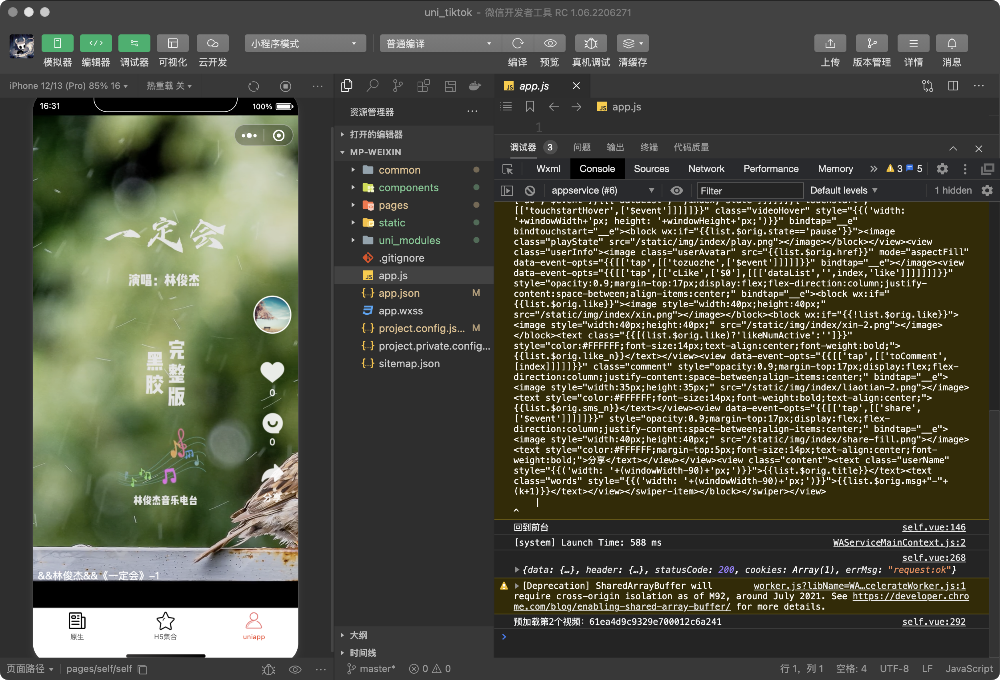
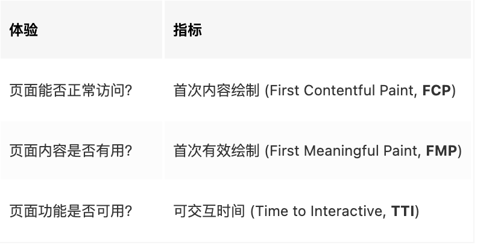
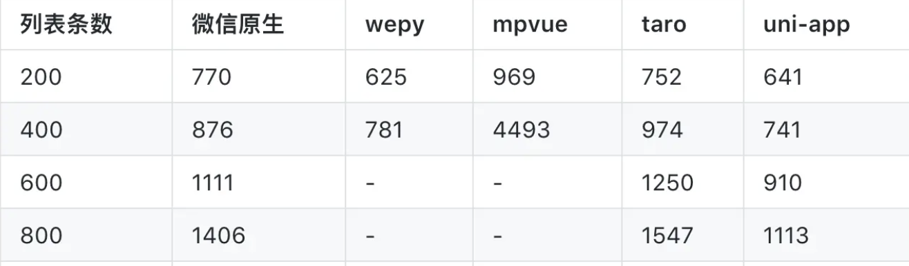
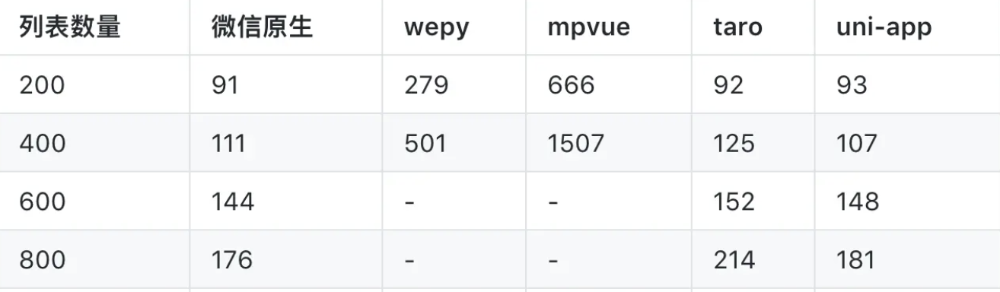

# 探寻小程序高性能之路

面向 C 端的产品时刻迎接用户量的挑战，对于一个合格的产品，最好的体验就是用户的无感。任何细微的体验细节都有可能被无限放大。为此“极致的页面性能”、“有好的产品体验”和“稳定的系统服务”应当是一个开发团队最基本的执行原则。

自接到 618 需求一个月以来，除了完成 H5 版本的上线。我们团队仍然坚持了三个不同版本的技术迭代，分别为纯原生小程序，原生小程序+H5 结合，uniapp 框架升级，三个版本的迭代如下图所示


## 如何定义高性能

提起性能问题，大部分人的第一反应是“是否足够快”，似乎首屏加载时间成为了衡量系统性能的唯一指标，但这是不准确的，如果一个小程序加载速度非常快，用户花费很短时间就能看到页面的主体内容，但此时搜索框却无法输入内容，功能无法被流畅使用，用户可能就不会关心页面渲染有多快了。所以，我们不应该单纯考虑速度指标而忽略用户的感知体验，而应该全方位衡量用户在使用过程中能感知到的与应用加载相关的每个节点。

在这里采用谷歌为 Web 应用定义了以用户为中心的性能指标体系，每个指标都与用户体验节点息息相关：


其中，“是否有用？” 这个问题是非常主观的，对于不同场景的系统可能会有完全不一样的回答，所以 FMP 是一个比较模糊的概念指标，不存在规范化的数值衡量。
小程序作为一个新的内容载体，衡量指标跟 Web 应用是非常类似的。对于大多数小程序而言，上述指标对应的含义为：

- FCP：白屏加载结束；
- FMP：首屏渲染完成；
- TTI：所有内容加载完成；

综上这是我们团队确定的高性能概念指标

## 小程序官方性能指标

小程序官方针对小程序性能表现制订了权威的数值指标，主要围绕 渲染表现、setData 数据量、元素节点数 和 网络请求延时 这几个维度来给予定义（下面只列出部分关键指标）：

- 首屏时间不超过 5 秒；
- 渲染时间不超过 500ms；
- 每秒调用 setData 的次数不超过 20 次；
- setData 的数据在 JSON.stringify 后不超过 256kb；
- 页面 WXML 节点少于 1000 个，节点树深度少于 30 层，子节点数不大于 60 个；
- 所有网络请求都在 1 秒内返回结果；

再不断地版本迭代中团队内部在官方性能指标的基础上，进一步优化指标系数，旨在对产品体验要求更高。

## 体验评分工具

小程序提供了 体验评分工具（Audits 面板） 来测量上述的指标数据，其集成在开发者工具中，在小程序运行时实时检查相关问题点，并为开发者给出优化建议。
体验评分工具是目前检测小程序性能问题最直接有效的途径，我们团队已经把体验评分作为页面/组件是否能达到精品门槛的重要考量手段之一。


## 第三方测速系统

很多时候，宏观的耗时系统对于性能瓶颈的分析往往是杯水车薪，我们需要更细致的针对某个页面关键节点作测速统计，排查出暴露性能问题的代码区块，定位到具体代码与个人才能更有效针对性能优化，这里的监控系统会在后续的迭代中开发使用，主要计划围绕页面 onLoad、onReady、数据加载完成、首屏渲染完成、各业务组件首次渲染完成 等几个关键节点统计测速上报，旨在全链路监控性能表现。

## 框架的选型

技术为业务服务，根据业务需求我们团队针对性的做了小程序端框架的选型。

从最初的微信原生开发，到 wepy、mpvue、taro、uni-app 等框架依次尝试
首先是对原生开发的尝试，我们的顾虑有

- 原生开发对 Node、预编译器、webpack 支持不好，影响开发效率和工程构建流程
- 微信定义了一个不伦不类的语法，不如正经学 vue、react，学会了全端通用，而不是只为微信小程序
- vue/react 生态里有太多周边工具，可以提高开发效率，比如 ide、校验器、三方库。
- 微信那个 ide 和专业编辑器相比实在不好用
  而框架的使用体验必须是每一个框架爱专业使用人员，而不是浅浅了解下这些框架。必须有真实的动手写多个平台的测试用例，比较各个平台的功能，性能，了解社区开源情况，技术服务情况。具有长期跟踪与报告的能力，避免信息的滞后。

在团队中我们评价好框架的维度主要有两个

- 用户：提供完整的业务实现，并保证高性能体验
- 开发者：平缓的学习曲线、现代开发体验（工程化）、高效的社区支持、活跃的开发迭代、多端复用

### 功能实现

软件开发，首要目标是向用户提供完整、闭环的业务功能。
在 web 开发中，如果 vue、react 等框架的使用，造成开发者无法操作浏览器提供的所有 api，那这样的框架肯定是不成熟的。小程序开发也一样，任何开发框架，都不能限制底层的 api 调用。
而各种业务功能底层依赖微信暴漏的组件和接口（微信官网介绍的组件和 API 规范,也即微信原生 API），三方框架是基于微信原生进行的二次封装，开发者此时常会有个疑问：小程序在不断的迭代升级，如果某项业务依赖于最新的小程序 API，但三方框架尚未封装，该怎么办？
实际上就像 web 开发的 vue、react 一样，浏览器出了一个新 API，并不会涉及 vue、react 的升级。这里详细解释下原因：

- wepy：未对小程序 API 作二次封装，API 依然使用微信原生的，框架与微信小程序是否新增 API 无关
- mpvue：支持微信的所有原生组件和 api，无限制。同时框架封装了自己的跨端 API，使用方式类似 mpvue.request()
- taro：支持微信的所有原生组件和 api，无限制。同时框架封装了自己的跨端 API，使用方式类似 Taro.request()，支持 Taro 代码与小程序代码混写，可通过混写的方式调用框架尚未封装的小程序新增 API
- uni-app：支持微信的所有原生组件和 api，无限制。在跨端方面，即便仍然使用微信原生的组件和 API，也可以直接跨端编译到 App、H5、以及支付宝百度头条等小程序。但为了管理清晰，推荐使用 uni 封装的 API，类似 uni.request()。同时支持条件编译，可在条件编译代码块中，随意调用各个平台新增的 API 及组件

### 性能体验

三方框架，内部大多做了层层封装，这些封装是否会增加运行负载，导致性能下降？尤其是与原生微信小程序开发相比性能怎么样，这是大家普遍关心的问题。
为客观的进行对比，我们特意搭建了一个测试模型，以业务为基础模拟抖音，支持无限刷新，点赞，收藏，评论，跳转等功能
其中最容易影响性能的就是长列表加载。这种复杂列表对性能压力很大，适合做性能测试。
测试方式：从页面空列表开始，通过程序自动触发加载，每次新增 20 条列表，记录单次耗时；固定间隔连续触发 N 次加载，使得页面达到 20\*N 条列表，计算这 N 次触发到渲染完成的平均耗时。

计算这 20 次的平均耗时，结果微信原生在这 20 次 触发 -> 渲染完成 的平均耗时为 876 毫秒，最快的 uni-app 是 741 毫秒，最慢的 mpvue 是 4493 毫秒

mpvue、wepy 诞生之初，微信小程序尚不支持自定义组件，无法进行组件化开发；mpvue、wepy 为解决这个问题，将用户编写的 Vue 组件，编译为 WXML 中的模板（template)，变相实现了组件化开发能力，提高代码复用性，这在当时的技术条件下是很棒的技术方案。
但如此方案，在页面复杂、组件较多的时，会大量增加页面 dom 节点数量，甚至超出微信的 dom 节点数限制。我们在 红米手机（Redmi 6 Pro）上实测，页面组件超过 500 个时，mpvue、wepy 实现的 App 就会报出如下异常，并停止渲染，故这两个测试框架在组件较多时，测试数据不完整。这也就意味着，当页面组件太多时，无法使用这 2 个框架。

#### 点赞组件响应速度

长列表中的某个组件，比如点赞组件，点击时是否能及时的修改未赞和已赞状态？是这项测试的评测点。
测试方式：

选中某视频，点击“点赞”按钮，实现点赞状态状态切换（已赞高亮、未赞灰色），
点赞按钮 onclick 函数开头开始计时，setData 回调函数开头结束计时；

在红米手机（Redmi 6 Pro）上进行多次测试，求其平均值，结果如下：

也就是在列表数量为 400 时，微信原生开发的应用，点赞按钮从点击到状态变化需要 111 毫秒。

## 在满足用户业务需求的前提下，我们谈谈开发者的需求，从如下几个维度比较：

- 平缓的学习曲线：简单易学，最好能复用现有技术栈，丰富的学习资料
- 高效的开发体验：现代前端开发流程、工程化支持
- 高效的社区支持：遇到问题，可很快的寻求到帮助
- 活跃的开发迭代：框架处于积极更新升级状态，无需担心停更

## 了解小程序底层架构

为了更好地为小程序制订性能优化措施，我们有必要先了解小程序的底层架构，以及与 web 浏览器的差异性。

微信小程序是大前端跨平台技术的其中一种产物，与当下其他热门的技术 React Native、Weex、Flutter 等不同，小程序的最终渲染载体依然是浏览器内核，而不是原生客户端。

而对于传统的网页来说，UI 渲染和 JS 脚本是在同一个线程中执行，所以经常会出现 “阻塞” 行为。微信小程序基于性能的考虑，启用了双线程模型：

- 视图层：也就是 webview 线程，负责启用不同的 webview 来渲染不同的小程序页面；
- 逻辑层：一个单独的线程执行 JS 代码，可以控制视图层的逻辑；

然而，任何线程间的数据传输都是有延时的，这意味着逻辑层和视图层间通信是异步行为。除此之外，微信为小程序提供了很多客户端原生能力，在调用客户端原生能力的过程中，微信主线程和小程序双线程之间也会发生通信，这也是一种异步行为。这种异步延时的特性会使运行环境复杂化，稍不注意，就会产出效率低下的编码。
作为小程序开发者，我们常常会被下面几个问题所困扰：

- 小程序启动慢；
- 白屏时间长；
- 页面渲染慢；
- 运行内存不足；

接下来，我们会结合小程序的底层架构分析出这些问题的根本原因，并针对性地给出解决方案。

## 小程序启动慢

在这个阶段中（包括启动前后的时机），微信会默默完成下面几项工作：

### 1. 准备运行环境：

在小程序启动前，微信会先启动双线程环境，并在线程中完成小程序基础库的初始化和预执行。

```shell
小程序基础库包括 WebView 基础库和 AppService 基础库，前者注入到视图层中，后者注入到逻辑层中，分别为所在层级提供其运行所需的基础框架能力。
```

### 2. 下载小程序代码包：

在小程序初次启动时，需要下载编译后的代码包到本地。如果启动了小程序分包，则只有主包的内容会被下载。另外，代码包会保留在缓存中，后续启动会优先读取缓存。

### 3. 加载小程序代码包：

小程序代码包下载好之后，会被加载到适当的线程中执行，基础库会完成所有页面的注册。

在此阶段，主包内的所有页面 JS 文件及其依赖文件都会被自动执行。

在页面注册过程中，基础库会调用页面 JS 文件的 Page 构造器方法，来记录页面的基础信息（包括初始数据、方法等）。

### 4. 初始化小程序首页：

在小程序代码包加载完之后，基础库会根据启动路径找到首页，根据首页的基础信息初始化一个页面实例，并把信息传递给视图层，视图层会结合 WXML 结构、WXSS 样式和初始数据来渲染界面。
综合考虑，为了节省小程序的“点点点”时间（小程序的启动动画是三个圆点循环跑马灯），除了给每位用户发一台高配 5G 手机并顺带提供千兆宽带网络之外，还可以尽量 控制代码包大小，缩小代码包的下载时间。

### 5.无用文件、函数、样式剔除

经过多次业务迭代，无可避免的会存在一些弃用的组件/页面，以及不被调用的函数、样式规则，这些冗余代码会白白占据宝贵的代码包空间。而且，目前小程序的打包会将工程下所有文件都打入代码包内，并没有做依赖分析。
因此，我们需要及时地剔除不再使用的模块，以保证代码包空间利用率保持在较高水平。通过一些工具化手段可以有效地辅助完成这一工作。

#### JS、CSS Tree-Shaking

JS Tree-Shaking 的原理就是借助 Babel 把代码编译成抽象语法树（AST），通过 AST 获取到函数的调用关系，从而把未被调用的函数方法剔除掉。不过这需要依赖 ES module，而小程序最开始是遵循 CommonJS 规范的，这意味着是时候来一波“痛并快乐着”的改造了。
而 CSS 的 Tree-Shaking 可以利用 PurifyCSS 插件来完成。关于这两项技术，有兴趣的可以“谷歌一下”，这里就不铺开细讲了。

### 减少代码包中的静态资源文件

小程序代码包最终会经过 GZIP 压缩放在 CDN 上，但 GZIP 压缩对于图片资源来说效果非常低。如 JPG、PNG 等格式文件，本身已经被压缩过了，再使用 GZIP 压缩有可能体积更大，得不偿失。所以，除了部分用于容错的图片必须放在代码包（譬如网络异常提示）之外，建议开发者把图片、视频等静态资源都放在 CDN 上。

### 逻辑后移，精简业务逻辑

这是一个 “痛并快乐着” 的优化措施。“痛” 是因为需要给后台同学提改造需求，分分钟被打；“快乐” 则是因为享受删代码的过程，而且万一出 Bug 也不用背锅了...
通过让后台承担更多的业务逻辑，可以节省小程序前端代码量，同时线上问题还支持紧急修复，不需要经历小程序的提审、发布上线等繁琐过程。
总结得出，一般不涉及前端计算的展示类逻辑，都可以适当做后移。

### 部分页面 H5 化

类似 618 版本的上线过程，小程序提供了 web-view 组件，支持在小程序环境内访问网页。当实在无法在小程序代码包中腾出多余空间时，可以考虑降级方案 —— 把部分页面 h5 化。

小程序和 h5 的通信可以通过 JSSDK 或 postMessage 通道来实现，详见小程序开发文档。

## 白屏时间过长

白屏阶段，是指小程序代码包下载完（也就是启动界面结束）之后，页面完成首屏渲染的这一阶段，也就是 FMP (首次有效绘制)。
FMP 没法用标准化的指标定义，但对于大部分小程序来说，页面首屏展示的内容都需要依赖服务端的接口数据，那么影响白屏加载时间的主要由这两个元素构成：

- 网络资源加载时间；
- 渲染时间；

### 启用本地缓存

小程序提供了读写本地缓存的接口，数据存储在设备硬盘上。由于本地 I/O 读写（毫秒级）会比网络请求（秒级）要快很多，所以在用户访问页面时，可以优先从缓存中取上一次接口调用成功的数据来渲染视图，待网络请求成功后再覆盖最新数据重新渲染。除此之外，缓存数据还可以作为兜底数据，避免出现接口请求失败时页面空窗，一石二鸟。
但并非所有场景都适合缓存策略，譬如对数据即时性要求非常高的场景（如抢购入口）来说，展示老数据可能会引发一些问题。

### 分包预下载

如果开启了分包加载能力，在用户访问到分包内某个页面时，小程序才会开始下载对应的分包。当处于分包下载阶段时，页面会维持在 “白屏” 的启动态，这用户体验是比较糟糕的。
幸好，小程序提供了 分包预下载 能力，开发者可以配置进入某个页面时预下载可能会用到的分包，避免在页面切换时僵持在 “白屏” 态。

### 非关键渲染数据延迟请求

这是关键渲染路径优化的其中一个思路，从缩短网络请求时延的角度加快首屏渲染完成时间。

### 接口聚合，请求合并

在小程序中，发起网络请求是通过 wx.request 这个 API。我们知道，在 web 浏览器中，针对同一域名的 HTTP 并发请求数是有限制的；在小程序中也有类似的限制，但区别在于不是针对域名限制，而是针对 API 调用：

- wx.request （HTTP 连接）的最大并发限制是 10 个；
- wx.connectSocket （WebSocket 连接）的最大并发限制是 5 个；

超出并发限制数目的 HTTP 请求将会被阻塞，需要在队列中等待前面的请求完成，从而一定程度上增加了请求时延。因此，对于职责类似的网络请求，最好采用节流的方式，先在一定时间间隔内收集数据，再合并到一个请求体中发送给服务端。

### 图片资源优化

图片资源一直是移动端系统中抢占大流量的部分，尤其是对于电商系统。优化图片资源的加载可以有效地加快页面响应时间，提升首屏渲染速度。

#### WebP

WebP 是 Google 推出的一种支持有损/无损压缩的图片文件格式，得益于更优的图像数据压缩算法，其与 JPG、PNG 等格式相比，在肉眼无差别的图片质量前提下具有更小的图片体积（据官方说明，WebP 无损压缩体积比 PNG 小 26%，有损压缩体积比 JPEG 小 25-34%）。

#### 图片裁剪&降质

鉴于移动端设备的分辨率是有上限的，很多图片的尺寸常常远大于页面元素尺寸，这非常浪费网络资源（一般图片尺寸 2 倍于页面元素真实尺寸比较合适）。得益于内部强大的图片处理服务，我们可以通过资源的命名规则和请求参数来获取服务端优化后的图片：
裁剪成 100x100 的图片：https://{host}/s100x100_jfs/{file_path}；
降质 70%：https://{href}!q70；

### 骨架屏

一方面，我们可以从降低网络请求时延、减少关键渲染的节点数这两个角度出发，缩短完成 FMP（首次有效绘制）的时间。另一方面，我们也需要从用户感知的角度优化加载体验。
“白屏” 的加载体验对于首次访问的用户来说是难以接受的，我们可以使用尺寸稳定的骨架屏，来辅助实现真实模块占位和瞬间加载。

## 如何提升渲染性能

当调用 wx.navigateTo 打开一个新的小程序页面时，小程序框架会完成这几步工作：

1. 准备新的 webview 线程环境，包括基础库的初始化；
2. 从逻辑层到视图层的初始数据通信；
3. 视图层根据逻辑层的数据，结合 WXML 片段构建出节点树（包括节点属性、事件绑定等信息），最终与 WXSS 结合完成页面渲染；
   由于微信会提前开始准备 webview 线程环境，所以小程序的渲染损耗主要在后两者 数据通信 和 节点树创建/更新 的流程中。相对应的，比较有效的渲染性能优化方向就是：

- 降低线程间通信频次；
- 减少线程间通信的数据量；
- 减少 WXML 节点数量；

具体优化手段将在后续迭代中体现并补充进文档

## 内存占用过高

当小程序占用系统资源过高，就有可能会被系统销毁或被微信客户端主动回收。应对这种尴尬场景，除了提示用户提升硬件性能之外（譬如不断加载刷新视频），还可以通过一系列的优化手段降低小程序的内存损耗。

### 内存预警

小程序提供了监听内存不足告警事件的 API：wx.onMemoryWarning，旨在让开发者收到告警时及时释放内存资源避免小程序 Crash。然而对于小程序开发者来说，内存资源目前是无法直接触碰的，最多就是调用 wx.reLaunch 清理所有页面栈，重载当前页面，来降低内存负荷（此方案过于粗暴，别冲动，想想就好...）。
不过内存告警的信息收集倒是有意义的，我们可以把内存告警信息（包括页面路径、客户端版本、终端手机型号等）上报到日志系统，分析出哪些页面 Crash 率比较高，从而针对性地做优化，降低页面复杂度等等。

### 回收后台页面计时器

根据双线程模型，小程序每一个页面都会独立一个 webview 线程，但逻辑层是单线程的，也就是所有的 webview 线程共享一个 JS 线程。以至于当页面切换到后台态时，仍然有可能抢占到逻辑层的资源，譬如没有销毁的 setInterval、setTimeout 定时器：

```js
// Page A
Page({
  onLoad() {
    let i = 0;
    setInterval(() => {
      i++;
    }, 100);
  },
});
```

    即使如小程序的 <swiper> 组件，在页面进入后台态时依然是会持续轮播的。

正确的做法是，在页面 onHide 的时候手动把定时器清理掉，有必要时再在 onShow 阶段恢复定时器。坦白讲，区区一个定时器回调函数的执行，对于系统的影响应该是微不足道的，但不容忽视的是回调函数里的代码逻辑，譬如在定时器回调里持续 setData 大量数据，这就非常难受了...

### 避免频发事件中的重度内存操作

我们经常会遇到这样的需求：广告曝光、图片懒加载、导航栏吸顶等等，这些都需要我们在页面滚动事件触发时实时监听元素位置或更新视图。在了解小程序的双线程模型之后不难发现，页面滚动时 onPageScroll 被频发触发，会使逻辑层和视图层发生持续通信，若这时候再 “火上浇油” 调用 setData 传输大量数据，会导致内存使用率快速上升，使页面卡顿甚至 “假死”。所以，针对频发事件的监听，我们最好遵循以下原则：

- onPageScroll 事件回调使用节流；
- 避免 CPU 密集型操作，譬如复杂的计算；
- 避免调用 setData，或减小 setData 的数据量；
- 尽量使用 IntersectionObserver 来替代 SelectorQuery，前者对性能影响更小；

### 大图、长列表优化

据 小程序官方文档 描述，大图片和长列表图片在 iOS 中会引起 WKWebView 的回收，导致小程序 Crash。
对于大图片资源（譬如满屏的 gif 图）来说，我们只能尽可能对图片进行降质或裁剪，当然不使用是最好的。
对于长列表，譬如瀑布流，这里提供一种思路：我们可以利用 IntersectionObserver 监听长列表内组件与视窗之间的相交状态，当组件距离视窗大于某个临界点时，销毁该组件释放内存空间，并用等尺寸的骨架图占坑；当距离小于临界点时，再取缓存数据重新加载该组件。
然而无可避免地，当用户快速滚动长列表时，被销毁的组件可能来不及加载完，视觉上就会出现短暂的白屏。我们可以适当地调整销毁阈值，或者优化骨架图的样式来尽可能提升体验感。
小程序官方提供了一个 长列表组件，可以通过 npm 包的方式引入，有兴趣的可以尝试。
