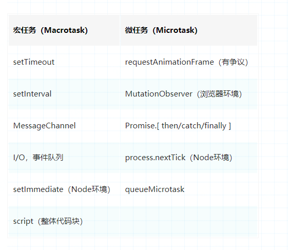
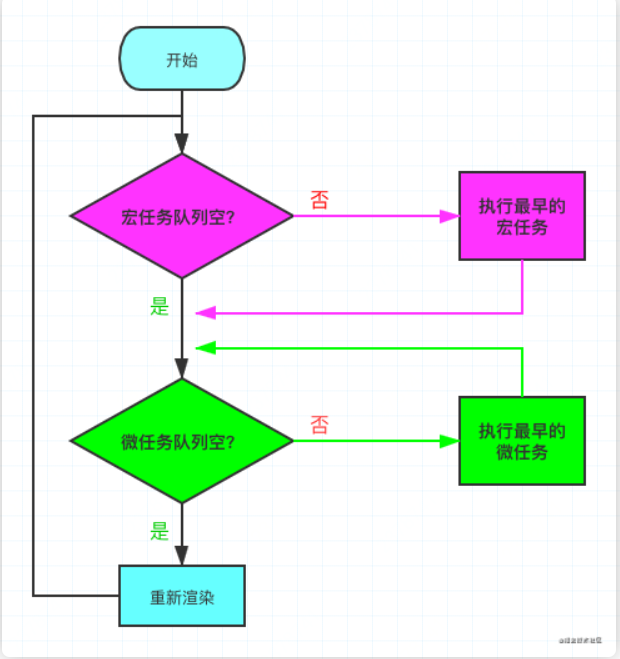

# promise

# 含义

简单说就是一个容器，里面保存着某个未来才会结束的事件（通常是一个异步操作）的结果。从语法上说，Promise 是一个对象，从它可以获取异步操作的消息。Promise 提供统一的 API，各种异步操作都可以用同样的方法进行处理。

Promise 对象有以下两个特点。

（1）对象的状态不受外界影响。Promise 对象代表一个异步操作，有三种状态：pending（进行中）、fulfilled（已成功）和 rejected（已失败）。只有异步操作的结果，可以决定当前是哪一种状态，任何其他操作都无法改变这个状态。这也是 Promise 这个名字的由来，它的英语意思就是“承诺”，表示其他手段无法改变。

（2）一旦状态改变，就不会再变，任何时候都可以得到这个结果。Promise 对象的状态改变，只有两种可能：从 pending 变为 fulfilled 和从 pending 变为 rejected。只要这两种情况发生，状态就凝固了，不会再变了，会一直保持这个结果，这时就称为 resolved（已定型）。如果改变已经发生了，你再对 Promise 对象添加回调函数，也会立即得到这个结果。这与事件（Event）完全不同，事件的特点是，如果你错过了它，再去监听，是得不到结果的。

注意，为了行文方便，本章后面的 resolved 统一只指 fulfilled 状态，不包含 rejected 状态。

有了 Promise 对象，就可以将异步操作以同步操作的流程表达出来，避免了层层嵌套的回调函数。此外，Promise 对象提供统一的接口，使得控制异步操作更加容易。

Promise 也有一些缺点。首先，无法取消 Promise，一旦新建它就会立即执行，无法中途取消。其次，如果不设置回调函数，Promise 内部抛出的错误，不会反应到外部。第三，当处于 pending 状态时，无法得知目前进展到哪一个阶段（刚刚开始还是即将完成）。

如果某些事件不断地反复发生，一般来说，使用 Stream 模式是比部署 Promise 更好的选择。

then 方法可以接受两个回调函数作为参数。第一个回调函数是 Promise 对象的状态变为 resolved 时调用，第二个回调函数是 Promise 对象的状态变为 rejected 时调用。这两个函数都是可选的，不一定要提供。它们都接受 Promise 对象传出的值作为参数。

下面是一个 Promise 对象的简单例子。

```js
function timeout(ms) {
  return new Promise((resolve, reject) => {
    setTimeout(resolve, ms, "done");
  });
}

timeout(100).then((value) => {
  console.log(value);
});
```

上面代码中，timeout 方法返回一个 Promise 实例，表示一段时间以后才会发生的结果。过了指定的时间（ms 参数）以后，Promise 实例的状态变为 resolved，就会触发 then 方法绑定的回调函数。

Promise 新建后就会立即执行。

如果调用 resolve 函数和 reject 函数时带有参数，那么它们的参数会被传递给回调函数。reject 函数的参数通常是 Error 对象的实例，表示抛出的错误；resolve 函数的参数除了正常的值以外，还可能是另一个 Promise 实例，比如像下面这样。

```js
const p1 = new Promise(function (resolve, reject) {
  // ...
});

const p2 = new Promise(function (resolve, reject) {
  // ...
  resolve(p1);
});
```

上面代码中，p1 和 p2 都是 Promise 的实例，但是 p2 的 resolve 方法将 p1 作为参数，即一个异步操作的结果是返回另一个异步操作。

注意，这时 p1 的状态就会传递给 p2，也就是说，p1 的状态决定了 p2 的状态。如果 p1 的状态是 pending，那么 p2 的回调函数就会等待 p1 的状态改变；如果 p1 的状态已经是 resolved 或者 rejected，那么 p2 的回调函数将会立刻执行。

```js
const p1 = new Promise(function (resolve, reject) {
  setTimeout(() => reject(new Error("fail")), 3000);
});

const p2 = new Promise(function (resolve, reject) {
  setTimeout(() => resolve(p1), 1000);
});

p2.then((result) => console.log(result)).catch((error) => console.log(error));
// Error: fail
```

上面代码中，p1 是一个 Promise，3 秒之后变为 rejected。p2 的状态在 1 秒之后改变，resolve 方法返回的是 p1。由于 p2 返回的是另一个 Promise，导致 p2 自己的状态无效了，由 p1 的状态决定 p2 的状态。所以，后面的 then 语句都变成针对后者（p1）。又过了 2 秒，p1 变为 rejected，导致触发 catch 方法指定的回调函数。

注意，调用 resolve 或 reject 并不会终结 Promise 的参数函数的执行。

```js
new Promise((resolve, reject) => {
  resolve(1);
  console.log(2);
}).then((r) => {
  console.log(r);
});
// 2
// 1
```

上面代码中，调用 resolve(1)以后，后面的 console.log(2)还是会执行，并且会首先打印出来。这是因为立即 resolved 的 Promise 是在本轮事件循环的末尾执行，总是晚于本轮循环的同步任务。

一般来说，调用 resolve 或 reject 以后，Promise 的使命就完成了，后继操作应该放到 then 方法里面，而不应该直接写在 resolve 或 reject 的后面。所以，最好在它们前面加上 return 语句，这样就不会有意外。

```js
new Promise((resolve, reject) => {
  return resolve(1);
  // 后面的语句不会执行
  console.log(2);
});
```

## 应用

加载图片
我们可以将图片的加载写成一个 Promise，一旦加载完成，Promise 的状态就发生变化。

```js
const preloadImage = function (path) {
  return new Promise(function (resolve, reject) {
    const image = new Image();
    image.onload = resolve;
    image.onerror = reject;
    image.src = path;
  });
};
```

## promise 实现

### 初见雏形

根据 promise 规范,promise 构造函数返回一个 promise 对象实例,并且有一个 then 方法,其中 then 有两个参数，分别是 onfulfilledh 和 onrejected.

onfulfilled 通过系数获取 promise 经过 resolve 的值,onreject 获取 promise 对象经过 reject 处理后的值

```js
function Promise(executor) {
  Promise.prototype.then = function (onfulfilled, onrejected) {};
}
```

promise 有三种状态 pending、fulfilled、rejected.需要一个变量储存 promise 状态。还需要有两个变量，分别储存 resolve 或者 reject 传过来的结果值。
还需要定义两个函数 resolve,reject 供开发者使用

```js
function Promise(executed){
  this.status = 'pending'
  this.value = null
  this.reason = null
  const resolve = (value)=>{
  this.value = value
}
const reject=(reson)=>{
  this.reason = reason
}
  executor(resolve, reject)
}

function noop(){}

Promise.prototype.then=function(onfulfilled,onreject)
```

### 状态完善

promise 实例的状态只能从 pending 变为 fulfilled 或者 rejected.状态一旦更改，就不能再次发生变化

```js
function Promise(executor) {
  this.status = "pending";
  this.value = null;
  this.reason = null;
  const resolve = (value) => {
    if (this.status === "pending") {
      this.value = value;
      this.status = "fulfilled";
    }
  };
  const reject = (reason) => {
    if (this.status === "pending") {
      this.reason = reason;
      this.status = "rejected";
    }
  };
  executor(resolve, reject);
}

function noop() {}
Promise.prototype.then = function (onfulfilled = noop, onrejected = noop) {
  if (this.status === "fulfilled") {
    onfulfilled(this.value);
  }
  if (this.status === "rejected") {
    onrejected(this.reason);
  }
};
```

### 实现异步

异步的关键在于 then 里面函数执行的时机，所以这里需要将 then 里面的函数先缓存下，然后 resolve 或者 reject 的时候执行。

注意 then 可以调用多次，所以需要存一个数组

当 resolve 或者 reject 的时候，全部执行。然后另外一个需要注意的细节是,当 excutor 代码本身执行就报错事，应当把 promise 的状态设置为 rejected，所以我们这里需要一个
try catch

```js
function Promise(executor) {
  this.status = "pending";
  this.value = null;
  this.reason = null;
  this.onfulfilledArr = []; // 存的都是then的第一个参数，即成功处理函数
  this.onRejectedArr = []; // 存的都是then的第二个参数，即失败处理函数
  const resolve = (value) => {
    if (this.status === "pending") {
      this.value = value;
      this.status = "fulfilled";
      this.onfulfilledArr.forEach((fn) => fn(value));
    }
  };
  const reject = (reason) => {
    if (this.status === "pending") {
      this.reason = reason;
      this.status = "rejected";
      this.onRejectedArr.forEach((fn) => fn(reason));
    }
  };
  try {
    executor(resolve, reject);
  } catch (error) {
    reject(error);
  }
}

function noop() {}
Promise.prototype.then = function (onfulfilled = noop, onrejected = noop) {
  if (this.status === "fulfilled") {
    onfulfilled(this.value);
  }
  if (this.status === "rejected") {
    onrejected(this.reason);
  }
  if (this.status === "pending") {
    this.onfulfilledArr.push(onfulfilled);
    this.onRejectedArr.push(onrejected);
  }
};
```

#### 细节完善

目前实现到这里，已经实现了基本的异步功能。回想一下 promise 的用法

```js
let promise = new Promise((resolve, reject) => {
  setTimeout(resolve, 1000);
});
promise.then(() => console.log("打印"));
```

之前的代码已经实现了这样的功能，即 1s 之后再进行打印操作。 但这里面有一个严重的问题还没有解决，看一下下面这个代码的输出

```js
let promise = new Promise((resolve, reject) => {
  resolve("data");
});
promise.then((data) => {
  console.log(data);
});
console.log(1);
```

promise 是微任务，应当在主循环结束之后再执行。所以这里应当先输出 1， 后输出 ‘data’, 而现在输出的结果正好相反。

所以 resolve 函数需要用 setTimeout 包裹一下，将函数执行推迟到主循环之后。但值得注意的是，setTimeout 是宏任务，并没有完全实现 promise 规范中定义的微任务。

所以有一些 promise 实现库用了 mutationObserver 来模仿 promise 原生实现。但这里为了实现方便姑且先用 setTimeout 代替。 看一下改动后的代码：

```js
const resolve = (value) => {
  setTimeout(() => {
    if (this.status === "pending") {
      this.value = value;
      this.status = "fulfilled";
      this.onfulfilledArr.forEach((fn) => fn(value));
    }
  });
};
```

### 链式调用

```js
let promise = new Promise((resolve, reject) => {
  setTimeout(() => resolve("data"), 1000);
});
promise
  .then((data) => {
    console.log(data);
    return "next"; // 这里有可能返回一个普通值，或者又一个promise
  })
  .then((data) => {
    console.log(data);
  });
```

从以上代码可以看出，then 的实现需要返回一个 promise。 then 中的回调函数的执行结果可能返回一个普通值，或者又一个 promise。 这里先处理只会返回普通值的情况:

```js
Promise.prototype.then = function (onfulfilled = noop, onrejected = noop) {
  let promise2; // then方法返回一个promise

  if (this.status === "fulfilled") {
    return (promise2 = new Promise((resolve, reject) => {
      setTimeout(() => {
        try {
          const result = onfulfilled(this.value);
          resolve(result);
        } catch (error) {
          reject(error);
        }
      });
    }));
  }

  if (this.status === "rejected") {
    return (promise2 = new Promise((resolve, reject) => {
      setTimeout(() => {
        try {
          const result = onrejected(this.reason);
          resolve(result);
        } catch (error) {
          reject(error);
        }
      });
    }));
  }

  if (this.status === "pending") {
    return (promise2 = new Promise((resolve, reject) => {
      this.onfulfilledArr.push(() => {
        try {
          const result = onfulfilled(this.value);
          resolve(result);
        } catch (error) {
          reject(error);
        }
      });

      this.onRejectedArr.push(() => {
        try {
          const result = onrejected(this.reason);
          resolve(result);
        } catch (error) {
          reject(error);
        }
      });
    }));
  }
};
```

比较好理解的是，如果当前 promise 的状态是 fulfilled 和 rejected 的情况。

当 promise 处于这两种情况时，直接执行 then 里的回调函数。 然后决议 promise2 的状态， 即当前 promise 的状态为 fulfulled 时，也将 promise2 的状态 resolve 掉。

注意，这里我假设 then 里回调函数的执行结果只会返回普通值，当回调执行出错时，才会将 promise2 设为 rejected。

这里比较难理解的是，如果当前 promise 状态为 pending 时，该怎么处理。

这里其实 promise2 的决议时机就是，处理完 onfulfilledArr 或者 onfulfilledArr 里的任务后，也就是执行完之前添加的所有任务，然后决议 promise2 的状态。

### 链式调用(二) 完善异步

上面我们只处理了 then 里只返回普通值的情况，其实 then 还有可能继续返回一个 promise，这其实是我们最经常使用 promise 的情况, 如下：

```js
const promise = new Promise((resolve, reject) => {
  setTimeout(() => resolve("data"), 1000);
})
  .then((data) => {
    // 又返回了一个promise
    return new Promise((resolve) => {
      setTimeout(() => {
        resolve(data + 1);
      }, 1000);
    });
  })
  .then((data) => {
    console.log(data);
  });
```

将 then 里代码稍微重构一下，使其支持返回 promise

```js
Promise.prototype.then = function (onfulfilled = noop, onrejected = noop) {
  let promise2 // then方法返回一个promise

  if (this.status === 'fulfilled') {
    return (promise2 = new Promise((resolve, reject) => {
      setTimeout(() => {
        try {
          const result = onfulfilled(this.value)
          resolvePromise(result, resolve, reject) // 这里不能像之前那样直接resolve,需要把resolve传递下去，由此方法进行决议
        } catch (error) {
          reject(error)
        }
      })
    }))
  }
  ...
```

接下来看一下 resolvePromise 的实现

```js
function resolvePromise(result, resolve, reject) {
  // 如果返回promise
  if (result instanceof Promise) {
    if (result.status === "pending") {
      result.then((data) => {
        resolvePromise(data, resolve, reject); // 套娃情况，有可能then回调执行的结果的结果又是一个promise，因此递归进行处理
      }, reject);
    } else {
      result.then(resolve, reject);
    }

    return;
  }

  // 如果返回普通值直接进行决议
  resolve(result);
}
```

这几行代码比较难以理解，思路就是将上层的 resolve 传到下层，将 promise2 的决议权交个 then 函数里返回的 promise。

终于，我们已经实现 promise 80%的功能。其中还剩下一些静态方法没有实现。例如 Promise.all() Promise.race() Promise.resolve() 但已经具备了基本的状态逻辑转换，异步和链式调用功能。

### 什么是宏任务与微任务

在异步模式下，创建异步任务主要分为宏任务与微任务两种。ES6 规范中，宏任务（Macrotask） 称为 Task， 微任务（Microtask） 称为 Jobs。宏任务是由宿主（浏览器、Node）发起的，而微任务由 JS 自身发起。

如何理解 script（整体代码块）是个宏任务呢 🤔
实际上如果同时存在两个 script 代码块，会首先在执行第一个 script 代码块中的同步代码，如果这个过程中创建了微任务并进入了微任务队列，第一个 script 同步代码执行完之后，会首先去清空微任务队列，再去开启第二个 script 代码块的执行。所以这里应该就可以理解 script（整体代码块）为什么会是宏任务。

#### 什么是事件循环


判断宏任务队列是否为空

不空 --> 执行最早进入队列的任务 --> 执行下一步
空 --> 执行下一步
判断微任务队列是否为空

不空 --> 执行最早进入队列的任务 --> 继续检查微任务队列空不空
空 --> 执行下一步
因为首次执行宏队列中会有 script（整体代码块）任务，所以实际上就是 Js 解析完成后，在异步任务中，会先执行完所有的微任务，这里也是很多面试题喜欢考察的。需要注意的是，新创建的微任务会立即进入微任务队列排队执行，不需要等待下一次轮回。
https://juejin.cn/post/6945319439772434469#heading-31
