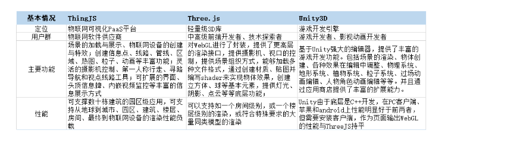

## webGL

### 是什么

对于 WebGL 百度百科给出的解释是 WebGL 是一种 3D 绘图协议，而对此维基百科给出的解释却是一种 JavaScript API。由于 WebGL 技术旨在帮助我们在不使用插件的情况下在任何兼容的网页浏览器中开发交互式 2D 和 3D 网页效果，我们可以将其理解为一种帮助我们开发 3D 网页的绘图技术，当然底层还是 JavaScript API。

### 发展

WebGL 的发展最早要追溯到 2006 年，WebGL 起源于 Mozilla 员工弗拉基米尔·弗基西维奇的一项 Canvas 3D 实验项目，并于 2006 年首次展示了 Canvas 3D 的原型。这一技术在 2007 年底在 FireFox 和 Opera 浏览器中实现。2009 年初 Khronos Group 联盟创建了 WebGL 的工作组最初的工作成员包括 Apple、Google、Mozilla、Opera 等。 2011 年 3 月 WebGL 1.0 规范发布，WebGL 2 规范的发展始于 2013 年，并于 2017 年 1 月最终完成，WebGL 2 的规范，首度在 Firefox 51、Chrome 56 和 Opera 43 中被支持。

### 着色器的概念

    WebGL 运行在电脑的 GPU 中，因此需要使用能在 GPU 上运行的代码，这样的代码需要提供成对的方法，每对方法中的一个叫顶点着色器而另外一个叫做片元着色器，并且使用 GLSL 语言。将顶点着色器和片元着色器连接起来的方法叫做着色程序。


    顶点着色器

    顶点着色器的作用是计算顶点的位置，即提供顶点在裁剪空间中的坐标值

    片元着色器

    片元着色器的作用是计算图元的颜色值，我们可以将片元着色器大致理解成网页中的像素


    顶点着色器和片元着色器这两个方法的运行都需要有对应的数据，其对应的获取方式有四种

    属性和缓冲

    缓冲是发送到 GPU 的一些二进制数据序列，通常情况下缓冲数据包括位置、方向、纹理坐标、顶点颜色值等。 当然你可以根据自己的需要存储任何你想要的数据。
    属性用于说明如何从缓冲中获取所需数据并将它提供给顶点着色器。

    全局变量

    全局变量在着色程序运行前赋值，在运行过程中全局有效。全局变量在一次绘制过程中传递给着色器的值都一样。

    纹理

    纹理是一个数据序列，可以在着色程序运行中随意读取其中的数据。一般情况下我们在纹理中存储的大都是图像数据，但你也可以根据自己喜欢存放除了颜色数据以外的其它数据

    可变量

    可变量是一种顶点着色器给片元着色器传值的方式

总结：
WebGL 只关心两件事：裁剪空间中的坐标值和颜色值。使用 WebGL 只需要给它提供这两个东西。 因此通过提供两个着色器来做这两件事，一个顶点着色器提供裁剪空间坐标值，一个片元着色器提供颜色值。

### WebGL 工作原理

了解完 WebGL 的一些基本概念， WebGL 在 GPU 上的工作主要分为两个部分，即顶点着色器所做的工作（将顶点转换为裁剪空间坐标）和片元着色器所做的工作（基于顶点着色器的计算结果绘制像素点）。假如我们需要绘制一个三角形，此时 GPU 上进行的工作便是先调用三次顶点着色器计算出三角形的 3 个顶点在裁剪空间坐标系中的对应位置，并通过变量 gl_Position 保存在 GPU 中，然后调用片元着色器完成每个顶点颜色值的计算，并通过变量 gl_FragColor 将对应的颜色值存储在 GPU 中。完成这些工作后我们已经得到了绘制三角形所需的像素点，最后便是光栅化三角形了。

#### cpvVSgpu

CPU 和 GPU 都属于处理单元，但是结构不同。形象点来说，CPU 就像个大的工业管道，等待处理的任务只能依次的通过这跟管道，所以 CPU 处理这些任务的速度完全取决于处理单个任务的时间。

CPU 管道虽然只能让任务一个一个依次执行，但是 CPU 处理单个任务的能力十分的强大，这样的特性让 CPU 处理一些大型任务时是足够了。但是处理图像却显得力不从心了，因为通常处理图像的逻辑并不是很复杂，另一方面，一幅图像是由成千上万的像素点组成，我们每次处理一个像素都是一个任务，让这么多的小任务依次通过我们的 CPU 管道，有点大马拉小车的味道了，此时，就需要我们的 GPU 登场了。

GPU 是由大量的小型处理单元构成的，它可能远远没有 CPU 那么强大，但胜在数量众多，可以保证每个单元处理一个简单的任务。GPU 能够保证同时处理所有的像素点。如果要进行一个比喻的话，GPU 处理的过程类似于我们祖宗发明的“活字印刷术”，将所有的字一次性排好，然后直接印在纸上，“印”这个动作就是 GPU 进行的过程。

gpu 和 cpu 的对比可以简单看作 100 个小学生和十个大学教授之间的对比

#### 渲染管线

我们可以想象 WebGL 就是一个巨大的电路，我们可以自定义这个电路中一些电线的走向，或者是给这个电路中添加一些元器件等等，然后我们只需要按下启动开关，这个电路就能够自己运作。

渲染管线主要分为以下几步：

    顶点着色器处理顶点
    图元装配
    光栅化
    片元着色器着色
    测试 & 混合

#### 顶点着色器

需要进行一些裁剪空间变换、平移、缩放、旋转等操作。这些操作都是对顶点进行的，它直接改变了顶点的位置。

#### 图元装配

通过顶点着色器的处理，我们得到了我们想要的顶点位置，假设我们现在得到了矩形的 4 个点的位置（实际上我们传入了 6 个点）。现在这一步，我们需要告诉 GPU 如何将这几个点以什么样的形式将这 6 个点组合起来（哪几个点为一组），这里我们选择每 3 个为一组，每一组表示一个三角形。将顶点装配成基本图形的过程就称为图元装配（WebGL 能够装配的基本图形只有：点、线、三角形）

#### 光栅化

上一步中，我们告诉了 GPU 如何去组装我们的顶点。目前为止，我们依然还是只有 6 个顶点的信息和装配的方式，但是我们如何使用这 6 个点和装配的方式将矩形表示在屏幕上呢？这就是光栅化的过程。一种简单的光栅化的方式就是：
遍历所有的像素为止，依次判断她们是否落入了我们刚刚组装的图形内，如果在图形内，则对该像素进行下一步操作（着色）。
除了判断是否在图形内的操作，还会对非顶点的位置进行插值处理，赋予每个像素其他的信息，因为一个像素不仅仅只有颜色信息，所以我们称其为“片元”。

#### 片元着色器着色

在光栅化的过程中，我们判断了哪些片元落在了我们的图形内，我们现在只需要对这些片元进行着色处理即可。最简单的着色方式就是直接设置一个颜色就可以了。 当然，片元着色器也可以很复杂，比如光照、材质等基本都是在片元着色器中进行完成的。

#### 数据传递

那我们如何在 js 运行时中往 WebGL 中传递数据呢？我们主要分为几个部分：

    传递attribute变量的数据（一般是顶点信息）
    传递一般的uniform变量数据（整数、浮点数、向量、矩阵）（一般是一些辅助信息，比如时间信息，某段程序需要根据时间的变化来计算最后的值）
    传递纹理

#### 传递 Attribute 变量

传递 attribute 变量的数据需要使用 WebGLBuffer 这个 WebGL 内置的数据结构。

步骤：

    创建WebGLBuffer
    绑定Buffer到ARRAY_BUFFER（gl.bindBuffer()）
    传入数据

```js
const colorBuffer = gl.createBuffer()
gl.bindBuffer(gl.ARRAY_BUFFER, colorBuffer)
gl.bufferData(gl.ARRAY_BUFFER, colorBufferData, gl.STATIC_DRAW)
```

这里 ARRAY_BUFFER 充当了一个桥梁的作用，我们其实是将数据传到了 ARRAY_BUFFER，ARRAY_BUFFER 在上一步已经与我们创建好的 WebGLBuffer 绑定在了一起了。所以数据直接写入了 WebGLBuffer。

#### 传递 Uniform 变量

传递 uniform 类型的变量的步骤就比较简单了。步骤如下：

通过 API 获取 uniform 变量在 WebGL 程序中的地址(gl.getUniformLocation)
再通过 API 这个地址中填充数据即可（gl.uniform1f， gl.uniform1i, gl.uniform2f......）

#### 传递纹理

首先，我们需要搞懂纹理是什么，简单的讲，纹理就是一张图片。在 Web 世界中，纹理可以是  <video/> <canvas/>标签，也可以是 ImageBitmap 和 TypedArray 对象。
传递纹理与传递 attribute 变量类似，这里我们不使用 WebGLBuffer，而是使用 WebGLTexture 对象，并且需要对 WebGLTexture 对象设置相应的参数。
步骤：

    创建纹理对象（WebGLTexture）(gl.createTexture())
    绑定纹理对象(gl.bindTexture)
    设置纹理参数
    传入纹理（gl.texImage2D）

这里我们也可以发现，gl.TEXTURE_2D 同样充当了桥梁的作用，我们直接操作的都是 gl.TEXTURE_2D，只不过我们已经提前将纹理对象与 TEXTURE_2D 绑定在一起了，相当于间接的操作了 WebGLTexture 对象了。

还记得我们之前将 WebGL 比喻成一个巨大的电路图吗？往 WebGL 中填充数据就是在给这个电路增加电气元件（WebGLTexture, WebGLBuffer），我们往其中填充数据，改变 WebGLBuffer/ARRAY_BUFFER, WebGLTexture/TEXTURE_2D 之间的绑定关系，其实就是在修改电路中电线的连接方式。当这一切就绪时，gl.drawArrays 这个 API 就仿佛是一个开关，调用这个函数整个电路就会自动运行起来。

### 不足

尽管从功能上而言原生 WebGL API 可以满足我们任意场景的开发需要但是，其开发和学习的成本极其昂贵。对于 WebGL 的初学者而言是极度不友好的，我们需要配置顶点着色器用于计算绘制顶点所在的位置，而这对于开发者而言需要一定的数学基础熟悉矩阵的运算，同时也要有空间几何的概念熟悉 3D 物体的空间分布。而场景的光照，纹理等的设计也都需要对颜色的配置有自己的见解

### 几种开发框架的简单对比

Three.js

Three.js 是 WebGL 的综合库，其应用范围比较广泛，美中不足的一点是，Three.js 库没有比较全面详细的官方文档，对于使用者而言不是特别友好

Cesium.js

Cesium.js 是专用于 3D 地图开发的 WebGL 库，其拥有较为全面的 3D 地图开发 API，对于需要开发 3D 地图的开发者而言是一个不错的选择，但针对其他场景的应用开发覆盖的就不是很全面了

Babylon.js

Babylon.js 是一款国外应用较广泛的 WebGL 库，感兴趣的小伙伴可以自己去了解一下，这里就不做详细介绍了

Three.js 是一款运行在浏览器中的 3D 引擎，你可以用它创建各种三维场景，同时 Three.js 也是一个综合性的 WebGL 库。如果你需要进行 3D 地图网页的开发那就可以用到 Cesium.js 了，Cesium.js 是一款专用于地图开发的 WebGL 库。而 Babylon.js 则是国外较火的 WebGL 库

基于 WebGL 周边衍生了众多的第三方库，其中 Three.js 属于开发应用，做了一定的渲染细节封装，ThingJS 则封装更多对模型的操作，力求让更多无 3D 开发经验的人员上手。以 Unity 3D 为代表的 OpenGL 出现更早，开发者可以在 Unity 3D 平台上构建各种 AR 和 VR 互动体验，同时可以发布 WebGL 版本。下面基于开发体验、场景资源和用户技能等三大维度比较这三款 3D 框架。


### 未来规划

### THREEJS 性能优化

    1. 多使用clone方法
    2. 模型不需要时dispose
    3. 使用BufferGeometry
    4. 图片压缩
    5. 优化渲染时requestAnimationFrame中的方法，不要重复定义，注意循环
    6. 模型减顶点减面，使用法线贴图
    7. 把材质精度降低，尽量共享材质
    8. 模型拆分加载，或把模型合并，合并有消耗，尽量在编辑器下合并
    9. 模型格式优化，使用gltf或glb
    10. LOD技术
    11. 异步、分片、缓存，如使用indexedDB存取模型
    12. 使用websocket，将一些计算放到后台执行
    13. 不需要显示的，可使用WebGLRenderTarget后台渲染，需要时再加入
    14. 阴影需要的才打开
    15. 渲染时，将执行的操作砍半
    16. import three会使打包后的JS多出几M，使用哪个import哪个较好
    17. 视锥体剔除不可见的物体
    18. 场景摄像机变化时才渲染场景，大部分大屏通常都是静止不动的，发生业务时有时才需要人机交互。
