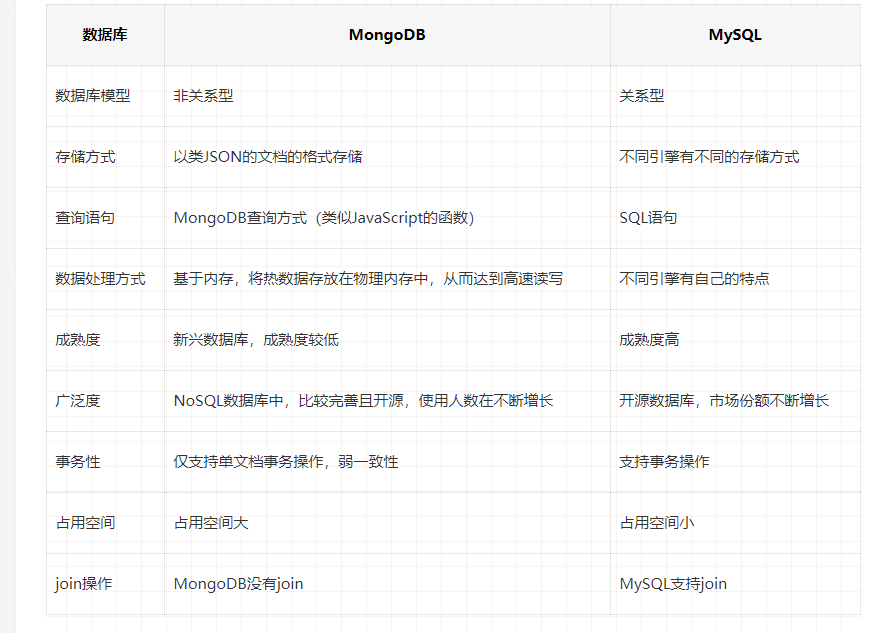

### js 的一些对比

#### 箭头函数与普通函数的区别

1、箭头函数会捕获其上下文的 this 值，作为自己的 this 值，定义的是偶就确定并固定了。
2、箭头函数不能作为构造函数使用，也不能使用 new 关键字(因为箭头函数没有自己的 this,它的 this 其实是继承了外层执行环境中的 this,且 this 指向不会被改变，作为构造函数的 this 要是指向创建的新对象)
3、箭头函数没有自己的 arguments.在箭头函数中访问 arguments 实际上获得的是外层局部（函数）执行环境中的值
4、call,apply,bind 并不会影响其 this 指向
5、箭头函数没有原型 prototype
6、箭头函数不能当作 generator 函数，不能使用 yield 关键字

#### var,let 和 const 之间的区别

三个方面：
1、var 声明的变量存在变量提升，即变量可以在声明之前调用，值为 undefined
et 和 const 不存在变量提升问题(注意这个‘问题’后缀，其实是有提升的，只不过是 let 和 const 具有一个暂时性死区的概念，即没有到其赋值时，之前就不能用)，即它们所声明的变量一定要在声明后使用，否则报错。
2、块级作用域方面：var 不存在块级作用域,let 和 const 存在块级作用域
3、声明方面：var 允许重复声明变量,let 和 const 在同一作用域不允许重复声明变量。其中 const 声明一个只读的常量(因为如此，其声明时就一定要赋值，不然报错)。一旦声明，常量的值就不能改变。
4、如何使 const 声明的对象内属性不可变，只可读呢？：如果 const 声明了一个对象，对象里的属性是可以改变的。

```js
const obj = { name: "蟹黄" };
obj.name = "同学";
console.log(obj.name); //同学
```

因为 const 声明的 obj 只是保存着其对象的引用地址，只要地址不变，就不会出错。
使用 Object.freeze(obj) 冻结 obj,就能使其内的属性不可变,但它有局限，就是 obj 对象中要是有属性是对象，该对象内属性还能改变，要全不可变，就需要使用递归等方式一层一层全部冻结。

#### Bigint 和 Number 的区别

Number 类型的数字有精度限制，数值的精度只能到 53 个二进制位（相当于 16 个十进制位,
正负 9007199254740992），大于这个范围的整数，就无法精确表示了。
Bigint 没有位数的限制，任何位数的整数都可以精确表示。但是其只能用于表示整数，且为了与 Number 进行区分，BigInt 类型的数据必须添加后缀 n。BigInt 可以使用负号（-），但是不能使用正号（+）。
另外 number 类型的数字和 Bigint 类型的数字不能混合计算。
12n+12;//报错

#### 基本数据类型和引用数据类型的区别

基本数据类型：
a. 基本数据类型的值是不可变的,这里你就可以联想到，是不是所有关于字符串和数字的方法都是带有返回值的，而不是改变原字符串或数字。
b. 基本数据类型不可以添加属性和方法，虽然不会报错，但也只是一瞬间转为了相应包装对象，操作完又转化回原基本数据类型，不会保存结果。
c. 基本数据类型的赋值是简单赋值,基本数据类型的比较是值的比较。
d. 基本数据类型是存放在栈区的
引用数据类型：
a. 引用类型的值是可以改变的,例如对象就可以通过修改对象属性值更改对象。
b. 引用类型可以添加属性和方法。
c. 引用类型的赋值是对象引用,即声明的变量标识符，存储的只是对象的指针地址。
d. 引用类型的比较是引用(指针地址)的比较。
e. 引用类型是同时保存在栈区和堆区中的,栈区保存变量标识符和指向堆内存的地址。

#### defer 和 async 的区别

大家应该都知道在 script 标签内有这两个属性 async 和 defer，例如<script src="./home.js" async defer></script>
defer：中文意思是延迟。用途是表示脚本会被延迟到整个页面都解析完毕后再运行。因此，在 script 元素中设置 defer 属性，相当于告诉浏览器立即下载，但延迟执行。HTML5 规范要求脚本按照它们出现的先后顺序执行，因此第一个延迟脚本会先于第二个延迟脚本执行,但执行脚本之间存在依赖，需要有执行的先后顺序时，就可以使用 defer,延迟执行。我觉得把 script 脚本放在 body 底部和 defer 差不多。
async：中文意思是异步，这个属性与 defer 类似，都用于改变处理脚本的行为。同样与 defer 类似，async 只适用于外部脚本文件，并告诉浏览器立即下载文件。但与 defer 不同的是，标记为 async 的脚本并不保证按照它们的先后顺序执行。
指定 async 属性的目的是不让页面等待两个脚本下载和执行，从而异步加载页面其他内容,这使用于之间互不依赖的各脚本。
当网页交给浏览器的 HTML 解析器转变成一系列的词语（Token）。解释器根据词语构建节点（Node），形成 DOM 树。因为 JavaScript 代码可能会修改 DOM 树的结构，所以节点是 JavaScript 代码的话，就需要停止当前 DOM 树的创建，直到 JavaScript 的资源加载并被 JavaScript 引擎执行后才继续 DOM 树的创建。
这里就会产生阻塞，出现白屏问题(白屏问题优化有很多方面，这里就脚本阻塞这一小点)，我们就可以使用 async 和 defer 属性来解决 JavaScript 脚本阻塞问题。
当然最稳妥的办法还是把 script 标签放置在 body 的底部，没有兼容性问题，不会因此产生白屏问题，没有执行顺序问题。

#### async await 对比 promise 的优缺点

async/await 优点：
a. 它做到了真正的串行的同步写法，代码阅读相对容易

b. 对于条件语句和其他流程语句比较友好，可以直接写到判断条件里面

```js
function a() {
  return new Promise((resolve, reject) => {
    setTimeout(() => {
      resolve(222);
    }, 2222);
  });
}
async function f() {
  try {
    if ((await a()) === 222) {
      console.log("yes, it is!"); // 会打印
    }
  } catch (err) {
    // ...
  }
}
```

c. 处理复杂流程时，在代码清晰度方面有优势
async/await 缺点：
a. 无法处理 promise 返回的 reject 对象，要借助 try...catch...

b. 用 await 可能会导致性能问题，因为 await 会阻塞代码，也许之后的异步代码并不依赖于前者，但仍然需要等待前者完成，导致代码失去了并发性。
//promise
Promise.all([ajax1(), ajax2()])
c. try...catch...内部的变量无法传递给下一个 try...catch...,Promise 和 then/catch 内部定义的变量，能通过 then 链条的参数传递到下一个 then/catch，但是 async/await 的 try 内部的变量，如果用 let 和 const 定义则无法传递到下一个 try...catch...，只能在外层作用域先定义好。

但 async/await 确确实实是解决了 promise 一些问题的。更加灵活的处理异步
promise 的一些问题：
a. 一旦执行，无法中途取消，链式调用多个 then 中间不能随便跳出来
b. 错误无法在外部被捕捉到，只能在内部进行预判处理，如果不设置回调函数，Promise 内部抛出的错误，不会反应到外部
c. Promise 内部如何执行，监测起来很难，当处于 pending 状态时，无法得知目前进展到哪一个阶段（刚刚开始还是即将完成）

#### get 和 post 的区别

a. GET 是将参数写在 URL 中 ? 的后面，并用 & 分隔不同参数；而 POST 是将信息存放在 Message Body 中传送，参数‘不会’显示在 URL 中(Restful 规范中是这样，但 post 在有需要时可以把参数放 URL 里)。GET 方式需要使用 Request.QueryString 来取得变量的值，而 POST 方式通过 Request.Form 来获取变量的值。 也就是说 Get 是通过地址栏来传值，而 Post 是通过提交表单来传值。
b. GET 请求提交的数据有长度限制（HTTP 协议本身没有限制 URL 及正文长度,对 URL 的限制大多是浏览器和服务器的原因），POST 请求没有内容长度限制。
c. GET 请求返回的内容会被浏览器缓存起来。而每次提交 POST 请求，浏览器不会缓存 POST 请求返回的内容。
d. GET 对数据进行查询，POST 主要对数据进行增删改！简单说，GET 是只读，POST 是写。
e. 关于安全性，GET 请求方式从浏览器的 URL 地址就可以看到参数；所以 post 更安全，其实无论是 GET 还是 POST 其实都是不安全的，因为 HTTP 协议是明文传输，只要拦截封包便能轻易获取重要资讯。想要安全传输资料，必须使用 SSL/TLS 来加密封包，也就是 HTTPS。
那为什么推崇使用 post 来处理敏感数据呢？
因为 get 的记录会保存在浏览器，上网日志中，而使用 Post，因为数据不会记录存储在浏览器的记录和网址访问记录中，这样会有更大的安全性。
f.一个误区 说 GET 产生一个 TCP 数据包；POST 产生两个 TCP 数据包
其说法：对于 GET 方式的请求，浏览器会把 http header 和 data 一并发送出去，服务端响应 200，请求成功。
对于 POST 方式的请求，浏览器会先发送 http header 给服务端，告诉服务端等一下会有数据过来，服务端响应 100 continue，告诉浏览器我已经准备接收数据，浏览器再 post 发送一个 data 给服务端，服务端响应 200，请求成功。
为其正名:上面所说的 post 会比 get 多一个 tcp 包其实不太严谨。多发的那个 expect 100 continue header 报文，是由客户端对 http 的 post 和 get 的请求策略决定的，目的是为了避免浪费资源，如带宽，数据传输消耗的时间等等。所以客户端会在发送 header 的时候添加 expect 100 去探探路，如果失败了就不用继续发送 data，从而减少了资源的浪费。所以是否再发送一个包取决了客户端的实现策略，和 get/post 并没什么关系。有的客户端比如 fireFox 就只发送一个包。

#### 用框架和不用框架的区别，vue 和 react 的区别

框架好处：
a. 使用框架工具写项目，在浏览器中代码依然是原生的 HTML CSS JS。而框架帮开发者做了很多事情，开发者只关注业务逻辑就可以,极大的加快了开发速度。
例如前端框架根本上是解决了 UI 与状态同步问题,频繁操作 DOM 性能低下.中间步骤过多,易产生 bug 且不易维护,而且心智要求较高不利于开发效率的一系列阻碍
b. 组件化: 其中以 React 的组件化最为彻底,甚至可以到函数级别的原子组件,高度的组件化可以是我们的工程易于维护、易于组合拓展。
c. 天然分层: JQuery 时代的代码大部分情况下是面条代码,耦合严重,现代框架不管是 MVC、MVP 还是 MVVM 模式都能帮助我们进行分层，代码解耦更易于读写。
d. 生态: 现在主流前端框架都自带生态,不管是数据流管理架构还是 UI 库都有成熟的解决方案
框架缺点：
a. 代码臃肿，使用者使用框架的时候会将整个框架引入，而框架封装了很多功能和组件，使用者必须按照它的规则使用，而实际开发中很多功能和组件是用不到的。

b. 框架迭代更新速度非常快，需要时间熟悉它。
具体区别请参考其他文章

#### cookies 和 session 的区别

a. 存储位置不同:cookie 的数据信息存放在客户端浏览器上，session 的数据信息存放在服务器上。
b. 存储容量不同:单个 cookie 保存的数据<=4KB，一个站点最多保存 20 个 Cookie，而对于 session 来说并没有上限，但出于对服务器端的性能考虑，session 内不要存放过多的东西，并且设置 session 删除机制。
c. 存储方式不同:cookie 中只能保管 ASCII 字符串，并需要通过编码方式存储为 Unicode 字符或者二进制数据。session 中能够存储任何类型的数据，包括且不限于 string，integer，list，map 等。
d. 隐私策略不同:cookie 对客户端是可见的，别有用心的人可以分析存放在本地的 cookie 并进行 cookie 欺骗，所以它是不安全的，而 session 存储在服务器上，对客户端是透明的，不存在敏感信息泄漏的风险。
e. 有效期上不同:开发可以通过设置 cookie 的属性，达到使 cookie 长期有效的效果。session 依赖于名为 JSESSIONID 的 cookie，而 cookie JSESSIONID 的过期时间默认为-1，只需关闭窗口该 session 就会失效，因而 session 不能达到长期有效的效果。
f. 服务器压力不同:cookie 保管在客户端，不占用服务器资源。对于并发用户十分多的网站，cookie 是很好的选择。session 是保管在服务器端的，每个用户都会产生一个 session。假如并发访问的用户十分多，会产生十分多的 session，耗费大量的内存。
g. 跨域支持上不同:cookie 支持跨域名访问。session 不支持跨域名访问。

#### 宏任务和微任务有什么区别

微任务和宏任务皆为异步任务，它们都属于一个队列，主要区别在于他们的执行顺序，Event Loop 的走向和取值。

宏任务和微任务的一些分配

```js
         宏任务   						       浏览器  	       Node
I/O	      								✅		✅
setTimeout								✅		✅
setInterval								✅		✅
setImmediate    							❌		✅
requestAnimationFrame           					✅		✅

         微任务
process.nextTick        						❌		✅
MutationObserver        						✅		❌
Promise.then catch finally              				✅		✅

```

宏任务与微任务之间的执行顺序(同步任务->微任务->宏任务)
下面说说执行到宏任务后是怎么继续运行的
(这里声明下，整段 js 代码就是第一个大的宏任务，事件循环是由这第一个宏任务开始的，然后分出微任务，这里是为了理解微任务宏任务的执行区别就先跳过这第一层)
说一个很有名的银行例子：银行柜台前排着一条队伍，都是存钱的人，存钱属于宏任务，这条队伍就是宏任务队列，当一个‘宏大爷’被叫到了自己的号码，就上前去--被处理，处理存钱业务时，‘宏大爷’突然想给自己的存款办个微理财(微任务)，那么银行职员就将他的需求添加到自己的微任务队列，大爷就不用再排队了，直接在存钱宏任务进行完后就处理衍生出来的微任务理财，办理财时大爷又说办个信用卡，那就又排到微任务队列里。但要是在此次存钱时‘宏大爷’说他还要存钱，且是他老伴要存钱，也是宏任务，但不好意思，需要取号到宏任务队列的后面排队（这里就是在宏任务进行时产生微任务和宏任务的处理方式）。


```js
<script>
    setTimeout(function () {//宏任务1
      console.log('1');
    });
    new Promise(function (resolve) {
      console.log('2');//同步任务1
      resolve();
    }).then(function () {//微任务1
      console.log('3');
    });
    console.log('4');//同步任务2
    setTimeout(function () {//宏任务2
      console.log('5');//宏任务2中的同步任务
      new Promise(function (resolve) {
        console.log('6');//宏任务2中的同步任务
        new Promise(function (resolve) {//宏任务2中的微任务
            console.log('x1');
            resolve();
          }).then(function () {
            console.log('X2');
          });
        setTimeout(function () {//宏任务2中的宏任务
          console.log('X3');
          new Promise(function (resolve) {//宏任务2中的宏任务中的同步任务
            console.log('X4');
            resolve();
          }).then(function () {//宏任务2中的宏任务中的微任务
            console.log('X5');
          });
        })
        resolve();
      }).then(function () {//宏任务2中的微任务
        console.log('7');
      });
    })
    setTimeout(function () {//宏任务3
      console.log('8');
    });
    //（对于这段代码node环境和浏览器环境输出一致）
    //输出答案：2,4,3,1,5,6,x1,x2,7,8,x3,x4,x5
  </script>

```

https://juejin.cn/post/6844903657264136200#heading-3

#### fetch,Ajax,axios 区别

Ajax 是什么：Ajax 是（Asynchronous JavaScript and XML）的缩写。现在，允许浏览器与服务器通信而无须刷新当前页面的技术都被叫做 Ajax。核心使用 XMLHttpRequest 对象。
axios 是什么：axios 是一个基于 Promise 用于浏览器和 nodejs 的 HTTP 客户端，本质上也是对原生 XHR 的封装，只不过它是 Promise 的实现版本，符合最新的 ES 规范。
fetch 是什么：Fetch 被称为下一代 Ajax 技术,采用 Promise 方式来处理数据。是一种简洁明了的 API，比 XMLHttpRequest 更加简单易用。
所以其主要区别是 axios、fetch 请求后都支持 Promise 对象 API，ajax 只能用回调函数。
具体了解 https://zhuanlan.zhihu.com/p/89089088

#### . TCP 和 UDP 的区别

a. TCP 是面向连接的，udp 是无连接的即发送数据前不需要先建立链接。
b. TCP 提供可靠的服务。也就是说，通过 TCP 连接传送的数据，无差错，不丢失，不重复，且按序到达; UDP 尽最大努力交付，即不保证可靠交付。 并且因为 tcp 可靠，
面向连接，不会丢失数据因此适合大数据量的交换。
c. TCP 是面向字节流，UDP 面向报文，并且网络出现拥塞不会使得发送速率降低（因
此会出现丢包，对实时的应用比如 IP 电话和视频会议等）。
d. TCP 只能是 1 对 1 的，而 UDP 支持 1 对 1,1 对多。
e. TCP 的首部较大为 20 字节，而 UDP 只有 8 字节。
f. TCP 是面向连接的可靠性传输，而 UDP 是不可靠的。

#### js 中的堆和栈,栈和队列有什么区别

堆(heap)和栈(stack)的区别:
堆：队列优先,先进先出；由操作系统自动分配释放 ，存放函数的参数值，局部变量的值等。其操作方式类似于数据结构中的栈。
栈：先进后出；动态分配的空间 一般由程序员分配释放， 若程序员不释放，程序结束时可能由 OS 回收，分配方式倒是类似于链表。
栈和队列的区别：
a. 栈只允许在表尾一端进行插入和删除，队列只允许在表尾一端进行插入，在表头一端进行删除。
b. 栈是先进后出，队列是先进先出。

#### WebSocket 和 HTTP 有什么区别

相同点
a. 都是一样基于 TCP 的，都是可靠性传输协议。

b. 都是应用层协议。

不同点
a. WebSocket 是双向通信协议，模拟 Socket 协议，可以双向发送或接受信息。HTTP 是单向的。

b. WebSocket 是需要握手进行建立连接的。
https://juejin.cn/post/6844903696560553991

#### http 和 https 的区别

a. HTTP 明文传输，数据都是未加密的，安全性较差，HTTPS（SSL+HTTP） 数据传输过程是加密的，安全性较好。
b. 使用 HTTPS 协议需要到 CA（Certificate Authority，数字证书认证机构） 申请证书，一般免费证书较少，因而需要一定费用。
c. HTTP 页面响应速度比 HTTPS 快，主要是因为 HTTP 使用 TCP 三次握手建立连接，客户端和服务器需要交换 3 个包，而 HTTPS 除了 TCP 的三个包，还要加上 ssl 握手需要的 9 个包，所以一共是 12 个包。
d. http 和 https 使用的是完全不同的连接方式，用的端口也不一样，前者是 80，后者是 443。
e. HTTPS 其实就是建构在 SSL/TLS 之上的 HTTP 协议，所以，要比较 HTTPS 比 HTTP 要更耗费服务器资源。

#### px,em,rem,vw,vh 区别

px: px 就是 pixel 的缩写，意为像素。px 就是一张图片最小的一个点，一张位图就是千千万万的这样的点构成的。
em: 参考物是父元素的 font-size，具有继承的特点。如果自身定义了 font-size 按自身来计算（浏览器默认字体是 16px），整个页面内 1em 不是一个固定的值。
rem: css3 新单位，相对于根元素 html（网页）的 font-size，不会像 em 那样，依赖于父元素的字体大小，而造成混乱。
vw: css3 新单位，viewpoint width 的缩写，视窗宽度，1vw 等于视窗宽度的 1%。
举个例子：浏览器宽度 1200px, 1 vw = 1200px/100 = 12 px。
vh: css3 新单位，viewpoint height 的缩写，视窗高度，1vh 等于视窗高度的 1%。
举个例子：浏览器高度 900px, 1 vh = 900px/100 = 9 px。

#### wepack 中 loader 和 plugin 的区别

什么是 loader?
loader 是文件加载器，能够加载资源文件，并对这些文件进行一些处理，诸如编译、压缩等，最终一起打包到指定的文件中
什么是 plugin？
在 webpack 运行的生命周期中会广播出许多事件，plugin 可以监听这些事件，在合适的时机通过 webpack 提供的 API 改变输出结果。
区别：

对于 loader，它是一个转换器，将 A 文件进行编译形成 B 文件，这里操作的是文件，比如将 A.scss 转换为 A.css，单纯的文件转换过程
plugin 是一个扩展器，它丰富了 webpack 本身，针对是 loader 结束后，webpack 打包的整个过程，它并不直接操作文件，而是基于事件机制工作，会监听 webpack 打包过程中的某些节点，执行广泛的任务

#### bind call apply 区别

a. 三者都可以改变函数的 this 对象指向。
b. 三者第一个参数都是 this 要指向的对象，如果如果没有这个参数或参数为 undefined 或 null，则默认指向全局 window。
c. 三者都可以传参，但是 apply 是数组，而 call 是参数列表，且 apply 和 call 是一次性传入参数，而 bind 可以分为多次传入。
d. bind 改变 this 指向后不会立即执行，而是返回一个永久改变 this 指向的函数便于稍后调用； apply, call 则是立即调用

#### 进程线程的区别

a. 根本区别：进程是操作系统资源分配的基本单位，而线程是处理器任务调度和执行的基本单位
b. 资源开销：每个进程都有独立的代码和数据空间（程序上下文），程序之间的切换会有较大的开销；线程可以看做轻量级的进程，同一类线程共享代码和数据空间，每个线程都有自己独立的运行栈和程序计数器（PC），线程之间切换的开销小。
c. 包含关系：如果一个进程内有多个线程，则执行过程不是一条线的，而是多条线（线程）共同完成的；线程是进程的一部分，所以线程也被称为轻权进程或者轻量级进程。
d. 内存分配：同一进程的线程共享本进程的地址空间和资源，而进程之间的地址空间和资源是相互独立的
e. 影响关系：一个进程崩溃后，在保护模式下不会对其他进程产生影响，但是一个线程崩溃整个进程都死掉。所以多进程要比多线程健壮。

nodejs 中的进程与线程
https://juejin.cn/post/6844903908385488903

#### JavaScript 和 typescript 的区别

a. TypeScript 从核心语言方面和类概念的模塑方面对 JavaScript 对象模型进行扩展。
b. JavaScript 代码可以在无需任何修改的情况下与 TypeScript 一同工作，同时可以使用编译器将 TypeScript 代码转换为 JavaScript。
c. TypeScript 通过类型注解提供编译时的静态类型检查。
d. TypeScript 中的数据要求带有明确的类型，JavaScript 不要求。
e. TypeScript 为函数提供了缺省参数值。
f. TypeScript 引入了 JavaScript 中没有的“类”概念。
h. TypeScript 中引入了模块的概念，可以把声明、数据、函数和类封装在模块中。

#### localstorage、sessionstorage、cookie 的区别

a. 相同点是都是保存在浏览器端、且同源的
b. cookie 数据始终在同源的 http 请求中携带（即使不需要），即 cookie 在浏览器和服务器间来回传递，而 sessionStorage 和 localStorage 不会自动把数据发送给服务器，仅在本地保存。cookie 数据还有路径（path）的概念，可以限制 cookie 只属于某个路径下
c. 存储大小限制也不同，cookie 数据不能超过 4K，同时因为每次 http 请求都会携带 cookie、所以 cookie 只适合保存很小的数据，如会话标识。sessionStorage 和 localStorage 虽然也有存储大小的限制，但比 cookie 大得多，可以达到 5M 或更大
d. 数据有效期不同，sessionStorage：仅在当前浏览器窗口关闭之前有效；localStorage：始终有效，窗口或浏览器关闭也一直保存，因此用作持久数据；cookie：只在设置的 cookie 过期时间之前有效，即使窗口关闭或浏览器关闭
e. 作用域不同，sessionStorage 不在不同的浏览器窗口中共享，即使是同一个页面；localstorage 在所有同源窗口中都是共享的；cookie 也是在所有同源窗口中都是共享的
f. webStorage(webstorage 是本地存储，存储在客户端，包括 localStorage 和 sessionStorage)支持事件通知机制，可以将数据更新的通知发送给监听者
h. webStorage 的 api 接口使用更方便

#### http 1.0/ 1.1/ 2.0 的不同

http 1.0(构建可扩展性)
HTTP 原有的应用非常局限，浏览器和服务器迅速扩展使其用途更广：
a. 版本信息现在会随着每个请求发送（HTTP1.0 被追加到 GET 行）
b. 状态代码行也会在响应开始时发送，允许浏览器本身了解请求的成功或失败，并相应地调整其行为（如以特定方式更新或使用本地缓存）
c. 引入了 HTTP 头的概念，无论是对于请求还是响应，允许传输元数据，并使协议非常灵活和可扩展。
d. Content-Type 标头告诉客户端实际返回的内容的内容类型。在 Content-Type 标头帮助下，增加了传输除纯文本 HTML 文件外的其他类型文档的能力。
http 1.1(标准化的协议)
HTTP/1.0 的多种不同的实现运用起来有些混乱，HTTP1.1 是第一个标准化版本，重点关注的是校正 HTTP 设计中的结构性缺陷：
a. 连接可以重复使用，节省了多次打开它的时间，以显示嵌入到单个原始文档中的资源。
b. 增加流水线操作，允许在第一个应答被完全发送之前发送第二个请求，以降低通信的延迟。
c. 支持响应分块。
d. 引入额外的缓存控制机制。
e. 引入内容协商，包括语言，编码，或类型，并允许客户端和服务器约定以最适当的内容进行交换。
f. 通过 Host 头，能够使不同的域名配置在同一个 IP 地址的服务器。
g. 安全性得到了提高
http 2.0(为了更优异的表现)
HTTP/2 在 HTTP/1.1 有几处基本的不同:
HTTP2 是二进制协议而不是文本协议。不再可读和无障碍的手动创建，改善的优化技术现在可被实施。
这是一个复用协议。并行的请求能在同一个链接中处理，移除了 HTTP/1.x 中顺序和阻塞的约束。
压缩了 headers。因为 headers 在一系列请求中常常是相似的，其移除了重复和传输重复数据的成本。
其允许服务器在客户端缓存中填充数据，通过一个叫服务器推送的机制来提前请求。

#### MongoDB 和 MySQL 的区别


